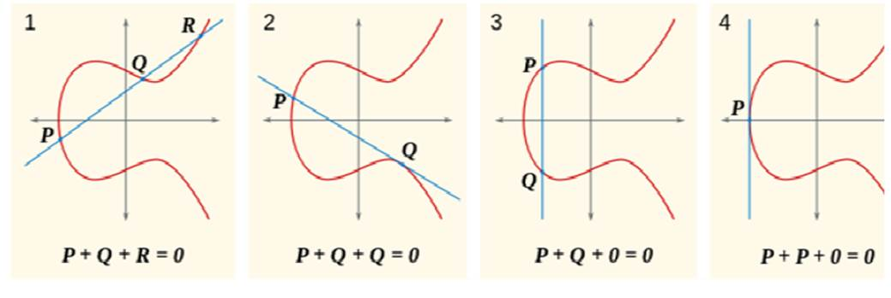

# 密码学

> 整理

## AES

> 2023 / 05 / 08

Advanced Encryption Standard

### 概况

AES 的密钥有 3 种：128 bit 循环轮数 10；192 bit 循环轮数 12；256 bit 循环轮数 14；

以 128 位 ( 16 字节)密钥为例，设 p 为明文，k 为密钥，则 AES 的加密过程如下：

~~~c
unsigned char a[4] = {0x03, 0x01, 0x01, 0x02};
unsigned char p[16];
AddRoundKey(p, k);
for(i=1; i<=10; i++) {
   	// 对 p 的每一个元素作替换
    // AES 的 sbox 和 DES 有所不同，进 8 位，出 8 位
    // AES sbox 中为 0 - 255 按照公式摆放，不重复
    // ByteSub 第二位是字节数
    ByteSub(p, 16); /* p[i] = sbox[p[i]]; */
    /*  ShiftRow:
        0 4 8 C -移0位-> 0 4 8 C
        1 5 9 D -移1位-> 5 9 D 1
        2 6 A E -移2位-> A E 2 6
        3 7 B F -移3位-> F 3 7 B
    */
    ShiftRow(p);
    /* MixColumn 较为复杂 */
    if(i != 10)
        MixColumn(p, a, 1); /* do mul */
    else
        MixColumn(p, a, 0); /* don't mul */
    /*  AddRoundKey:
    	每一轮的用于加密的密钥都不一样
    	内部代码为:
    	for (j = 0; j < 16; j++)
    		p[j] ^= k[i * 16 + j];
    	其中 k 的长度远大于 16 byte
    	k 的后续位为原始的 16 byte 种子密钥生成
    */
    AddRoundKey(p, k + i * (4 * 4));
}
~~~

### 数学基础

+ **有限域**：域 (field) 就是一个集合，我们可以在其上做加减乘除运算而不脱离该集合

  + 有限域中元素的个数称为有限域的阶 (order)
  + 有限域的阶必为素数 p 的幂,即p^n^，其中 n 为正整数
  + 对任意素数 p 和正整数 n，存在 p^n^ 阶的有限域，记为 GF(p^n^)。当 n = 1 时，**有限域 GF(p) 也称素域**

+ 例如 GF(2) 上有 2 个元素 0 和 1，加法定为**异或**，乘法定为**与**

+ 再例如 GF(2^8^) 对应 8 bit 的 2 进制数，加法就是**按位异或** (可得出该域上 x 的加法逆元就是 x 本身，$x \equiv -x$)，而对于乘法运算，举例以及代码如下：

  ~~~c
  /*
      x = 1011 0110 == 0xB6
      y = 0000 0011 == 0x03 *)
      ------------------------
          1011 0110
         10110 110
      ------------------------
         11101 1010 mod 0x11B => 等价于减法
         10001 1011 -) (由于之前的性质，减法即为加法，即为异或)
      ------------------------
         01100 0001 == 0xC1
  */
  /*---农夫算法，计算 x * y mod 0x11B---*/
  product = 0;
  while (x != 0 && y != 0) {
      // y 的个位是否为 1
      if (y & 1) product = product ^ x; // 加法
      x <<= 1, y >>= 1; // 被乘数 * 2，乘数 / 2，积不变
      if (x >= 0x100) x = x ^ 0x11B; // 相当于 mod 0x11B
  }  
  ~~~

  或者也可以用多项式的形式进行计算：

  10001000 * 00000101 mod 0x11B => $ ((x^7+x^3) * (x^2+1))\,mod\,(x^8+x^4+x^3+x+1)$

### MixColumn

~~~c
char plain[16] = {4, 8, 12, 16,
				  3, 7, 11, 15,
				  2, 6, 10, 14,
				  1, 5,  9, 13};
~~~

$\begin{bmatrix}2&3&1&1\\1&2&3&1\\1&1&2&3\\3&1&1&2\end{bmatrix} \times \begin{bmatrix}4\\3\\2\\1\end{bmatrix} = \begin{bmatrix}14\\5\\0\\15\end{bmatrix} \stackrel{存储时需要将列转行}{\longrightarrow} \begin{bmatrix}14&5&0&15\end{bmatrix}$

加密时，被乘数为 $3\,1\,1\,2$ ，解密时将其乘法逆元 $B\,D\,9\,E$，作为被乘数，将密文作为乘数，即可以还原出明文。 

这里的乘法需要运用农夫算法进行处理。

## RSA

> 2023 / 05 / 22

对称密码体制：加密和解密使用同一密钥。

RSA 算法采用公钥密码体制，也称非对称密码体制。

### 算法过程

1. 选取两个大素数，p 和 q，计算乘积 $n = p\,*\,q$，n 可以公开，p 和 q 保密。
2. 随机选取加密密钥 e，使 e 和 $(p-1)*(q-1)$ 互质。
3. 找出 d，使 $e\,*\,d= 1\,mod\,((p-1)*(q-1))$。
4. 加密：$c = m^e(mod\,n)$，解密：$m = c^d(mod\,n)$。
5. (e, n) 作为公钥 (公开)，(d, n) 作为私钥。

### 数学基础

**Euler 函数**：$\phi(n)$ - 小于n且与n互素的整数个数。若 $n_1,\,n_2$ 互素，则有 $\phi(n_1*n_2) = \phi(n_1)*\phi(n_2)$。此外有 $\phi(n) = \prod_{p\,|\,n} (1-\frac{1}{p})$ 其中 p 为 可以整除 n (即下标) 的素数。

**Euler 定理**：若 $gcd(x,\,n) = 1$，则 $x^{\phi(n)} = 1 (mod \, n)$

**Fermat 小定理**：可以由 Euler 定理得到，当 p 为素数时，有 $\phi(p) = p-1$，故有 $x^{p-1} = 1 (mod \, n)$。

**中国剩余定理**：设 m~1~, m~2~, m~3~ …, m~r~ 两两互素, 则以下同余方程组 x ≡ a~i~ (mod m~i~), i = 1, 2, 3, …r 模 M = m~1~ m~2~ m~3~ …m~r~ 的唯一解为

$x = \sum_{i = 1}^r a_i *M_i*(M_{i-1} \, mod \, m_i) \,mod\,M \,\,其中\, M_i = \frac{M}{m_i}$.

### 数字签名

发送方 A 给 接受方 B 发送信息 L。首先需要对信息进行加密。

信息加密的过程：1. (A) L' =  RSA(L, B 的公钥)。2. (B) L = RSA(L', B 的私钥)。

为确认发送方为 A，需要进行数字签名。

数字签名的过程：1. (A) M = md5(L)。2. (A) M' = RSA(M, A 的私钥)。3. (B) m = RSA(M', A 的公钥)，比较 m 与 M 是否相同即可。

## ECC

> 2023 / 06 / 05

椭圆曲线可以定义成所有满足方程 E: y^2^ = x^3^ + ax + b (mod p) 的点 (x, y) 所构成的集合。

若 x^3^ + ax + b 没有重复的因式或 4a^3^ + 27b^2^ ≠ 0 (称为判别式)，则 E: y^2^ = x^3^ + ax + b 能定义成为一个群。

### 数学基础

对于图 1 中，R 关于 x 轴的对称点 R' 于是有 P + Q = R'。其中所有点的横纵坐标都必须是整数。

(1) P + O = O + P = P

(2) 如果 P = (x~1~, y~1~)，Q = (x~2~, y~2~)，且有 x~1~ = x~2~ 及 y~1~ = y~2~ = 0，或有 x~1~ = x~2~ 及 y~1~ = -y~2~ ≠ 0，则 P + Q = O;

(3) 如果 P = (x~1~, y~1~)，Q = (x~2~, y~2~)，且排除(1)(2)，则 P + Q = (x~3~, y`3`) 由下列规则决定：

x~3~ = λ^2^ - x~1~ - x~2~；y~3~ = λ(x~1~ - x~3~) - y~1~；当 P ≠ Q 时，λ = (y~2~ - y~1~) / (x~2~ - x~1~)；当 P = Q 时，λ = (3x~1~^2^ + a) / (2y~1~) ；

a，b，p，基点 G (满足曲线的某一点)，G 的阶，余因子，六个概念决定了一条椭圆曲线。

n * G = 0 时称 n 是 G 的阶。1G，2G，...，nG 构成一个循环子群。(n + 1)G = 1G。满足曲线方程的所有点的个数称为曲线的阶。

余因子 = 曲线的阶 / G 的阶；

