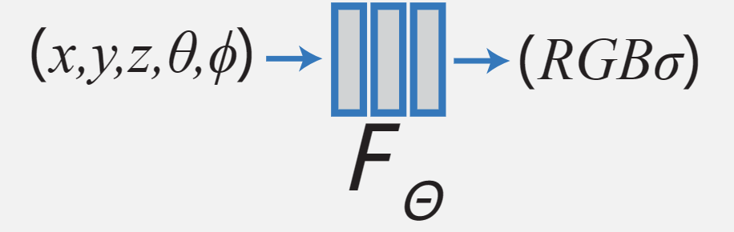
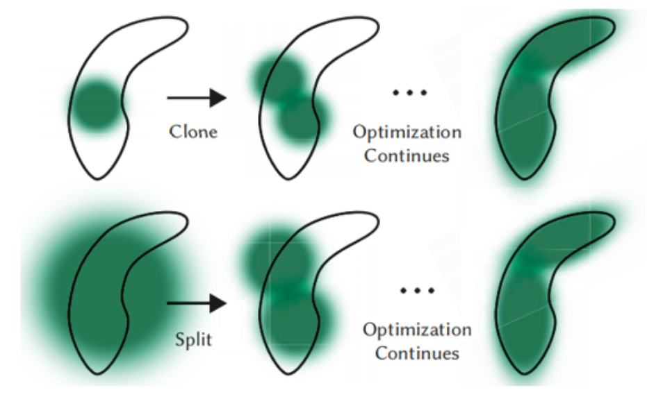
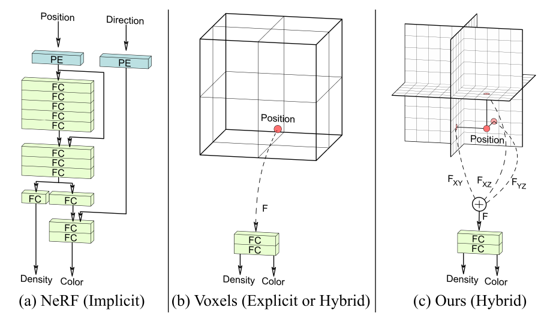

## NeRF, Gaussian Splatting and EG3D

> 2024 / 04 / 03

### 概念理解

#### NeRF

paper: [NeRF: Representing Scenes as Neural Radiance Fields for View Synthesis](http://arxiv.org/abs/2003.08934)

website: https://www.matthewtancik.com/nerf

code: [NeRF-pytorch](https://github.com/yenchenlin/nerf-pytorch.git)

Neural Radiance Fields，神经辐射场，仅用 2D 的 posed images 作为监督，即可表示复杂的三维场景，用于新视角合成。

Radiance Field 指的 是一个函数，它将一个点和一个方向映射到光线颜色上，可以预测在三维空间中的任何一个位置。换言之，如果你站在某个位置，并且看向某个特定方向，那么 Radiance Field 就决定了你看到的景象。论文中构建了一个包含 3 维的位置信息以及 2 维视角信息的辐射场，并且使用了基本的 MLP 网络进行表征。

NeRF 工作的基本流程可以总结如下：

- 使用一系列2D图片作为输入数据集，这些图片显示了同一场景从不同角度和位置拍摄得到的结果
- 首先会估计出每张图片对应相机参数(如位置、焦距等)
- 然后利用这些参数以及深度信息将2D像素转换为3D空间坐标和视线方向,并通过神经网络对Radiance Field进行学习

训练时，NeRF 会尝试描述一个 3D 场景，并尝试渲染图像进行训练。

生成新的图片时，首先需要确定视线的方向，图像上的每一个像素对应一条 ray，ray 在穿过 Radiance Field 时，会经过多个采样点，每个采样点包含其颜色信息以及透明度信息 (是否被遮挡)。

为优化 MLP 网络，论文中还提出了两种优化方法： **Positional encoding** 和 **Hierarchical volume sampling**。

Positional encoding 是通过将空间点的 3D 坐标映射到一个固定维度的向量空间来实现的。这个向量可以是任何形式，但通常是一组可学习的参数，这些参数通过网络的训练过程来学习。通过将空间点的坐标转换为这种向量表示，网络能够更好地理解场景中的空间结构，并生成更准确的三维重建结果。

Hierarchical Volume Sampling  则是一种提高渲染效率，降低渲染成本的方法。其具体的思路是同时使用两个网络，一者“粗糙”一者“精细”。将体积采样分为多个层级，首先先在各个层级上进行抽样采样。再根据评估结果以及需求进行自适应细化。

#### Gaussian Splatting

paper: [3D Gaussian Splatting for Real-Time Radiance Field Rendering](https://repo-sam.inria.fr/fungraph/3d-gaussian-splatting/3d_gaussian_splatting_high.pdf)

website: https://repo-sam.inria.fr/fungraph/3d-gaussian-splatting/

code: https://github.com/graphdeco-inria/gaussian-splatting.git

Gaussian splatting 主要在 NeRF 的基础上提升了视觉质量，并实现了实时的渲染。

传统的 3D 表示方式主要有点和 mesh 网格。但是直接采样的计算成本昂贵，而分层抽样渲染有可能引入噪声。

> `SfM`: 运动结构，是指在一系列的图片中寻找空间坐标一致的参考点，用以计算拍摄同一对象不同角度图片时摄像机的位置坐标。

在 Guassian splatting 中，并不是仅仅使用离散的点空间坐标表示场景信息，而是使用高斯分布描述一个点以及其可能的连续的空间概率分布。

> 一个 3D 高斯分布由位置 (均值)、各向协方差矩阵以及不透明度定义。

3D 高斯分布可微，可以方便地进行二维 splatting，混合上不透明度参数后，等效图像可以使用 NeRF 方法进行渲染。

接着论文对三维高斯分布表示进行了训练优化。需要优化的参数有每个高斯分布的位置、不透明度、各向协方差矩阵以及用于表征光照的 SH (球谐系数)。

训练的过程就是不断地把训练生成得到的视图与真实的视图进行比较。由于高斯概率分布覆盖的范围有可能过大也有可能过小，在训练过程中需要适当“分裂”或“克隆”高斯分布以更好地从稀疏地高斯分布中表征场景信息。

论文中还设计了一种 tile-based 光栅器的高斯 Splatting，以实现更为快速的整体渲染和排序。

### 论文阅读

#### Mip-NeRF

paper: [Mip-NeRF: A Multiscale Representation for Anti-Aliasing Neural Radiance Fields](https://jonbarron.info/mipnerf/)

code: https://github.com/google/mipnerf.git

##### Motivation

NeRF 可以渲染 3D 场景，但是若要对每一个像素都生成一条 ray 进行渲染则开销极大。进行分层抽样渲染则会导致模糊和重影。此外，由于根据坐标采样的特点，NeRF 在应对多种尺寸的分辨率的图像时，会出现混叠伪影。

##### Contribution

论文受到了计算机图形学中 MipMap 技术的启发，使用抗锯齿圆锥体代替了简单的射线，来解决混叠伪影的问题。

NeRF 中使用了正弦波编码来增加坐标的纬度，但会收到分辨率尺寸的制约。此文中提出了积分位置编码 (IPE)。允许网络以多尺度的方式来表征空间信息。

锥体射线的构造可以使尺寸信息显式地输入到 MLP 中，进一步适应多尺寸地学习与渲染。因此 Mip-NeRF 也进一步简化了 NeRF 中原有的“粗”“细”双 MLP 的形式，只保留了一个 MLP 网络。

#### DreamGuassian

paper: [DreamGaussian: Generative Gaussian Splatting for Efficient 3D Content Creation](http://arxiv.org/abs/2309.16653)

code: https://github.com/dreamgaussian/dreamgaussian.git

##### Motivation

解决当前基于优化方法的三维内容创建技术中存在的样本优化速度慢的问题。这限制了 3D 生成技术的实际应用。

##### Contribution

该论文主要是将 Guassian Splatting 应用到了 3D 内容生成领域。

此外，文中还提出了一种新的网格提取算法。论文利用了 Guassian Splatting 中“克隆”“分裂”的特性，将需要渲染的场景划分为多个小的区域，再应用 Marching Cubes 算法获取三维网格。

最终将需要渲染的对象展开为 UV-Map 进行进一步的优化。

### EG3D

paper: [Efficient Geometry-aware 3D Generative Adversarial Networks](https://arxiv.org/abs/2112.07945)

code: https://github.com/NVlabs/eg3d

##### Motivation

以往 GAN 只应用于 2D 图像，而现有的计算密集型 3D GAN 限制了生成图像的质量和分辨率，但若采用的近似方法又不利于实现多视图一致性及提升 3D 形状质量。

传统单一的显式体素表示、隐式神经网络表示，但两种方法的内存占用高，计算效率低，均不适合进行高分辨率的训练。如果使用 CNN 网络则会牺牲三维几何表示的质量和视觉一致性。

##### Contribution

论文中提出了一种隐式表示、显式表示的混合架构，相比完全使用隐式或显式方式这种混合方法具有高计算效率、高记忆效率的优势，避免了过量的硬件要求以及对卷积的依赖。显式的表达降低了 MLP 网络的规模，提升了计算的效率。

论文中继承了 StyleGAN2 的特性，并在特征空间上进行了改进。将原先的体素信息分解为三平面的信息，再通过神经网络的渲染，再经过超分辨率后进入判别器进行比对。最终就可以训练得到一个可以生成 3 平面信息的 GAN，用于 3D 信息的表征。

相机视角的变化许多情况下会与图片中对象的姿态相关联，如果不进行处理则可能会导致视角不一致。论文中单独将姿态进行解耦，将生成器的相机视角固定进行训练。

##### Datasets

real-world human face dataset: FFHQ

small, real-world cat face dataset: AFHQv2 Cats

##### Limitations

生成的 3D 模型依然有伪影，且细节较为缺乏。训练时仍需要获取相机的姿态，未来可能可以加入对相机姿态的动态学习并同时加强解耦。文中的生成模型是 StyleGAN2，其余的 2D 生成模型可能可以获得更好的效果。

