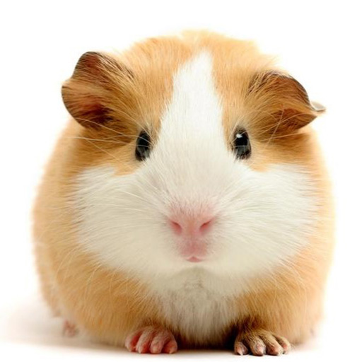
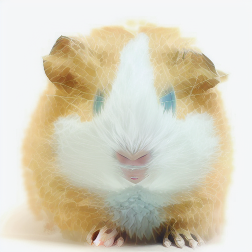

## 2023 / 10 / 25 总结

### 与 baseline 的比对

此部分成图片的 `content` 均为：

    

`concept` 图片如下：

|               1                |                   2                   |                 3                  |                   4                   |
| :----------------------------: | :-----------------------------------: | :--------------------------------: | :-----------------------------------: |
|  |  |  |  |

|                  |                              1                               |                              2                               |                              3                               |                              4                               |
| :--------------: | :----------------------------------------------------------: | :----------------------------------------------------------: | :----------------------------------------------------------: | :----------------------------------------------------------: |
|   **baseline**   |  |  |  |  |
|     **cfg**      |  |  |  |  |
| **cfg modified** |  |  |  |  |

`baseline` 使用 50 步 train_step，不使用 CFG 训练 target_embedding

`cfg` 使用 50 步 train_step，训练中有 0.5 的概率加上 cfg_loss

+  target 的计算公式为 $l2\_target = target + \frac{cfg\_ratio}{cfg\_ratio+1}(src\_pred-target)$，cfg_ratio = 2.0

可以观察到图片 1 的结果在色调上更加接近 concept。图片 2 在生成的精细程度上更高。图片 3 和图片 4 的生成效果差异不大，相对来说图片 4 略微更接近 concept。

`cfg modified` 使用 50 步 train_step，训练中有 0.5 的概率加上 cfg_loss

+  target 的计算公式为 $l2\_target = target + \frac{1}{cfg\_ratio+1}(src\_pred-target)$，cfg_ratio = 2.0

可以观察到图像 1 的生成质量得到了明显的提高，整体的扁平化风格更加明显。图片 2 的生成质量提升较多。出现了较为明显的毛发涂抹效果，包括眼睛部分，更为接近 concept 的风格。图片 3 图片 4 与 baseline 的差异不大，放大看之后可以发现图片的锐化得到了一定的改善。

### 不同 CFG 系数的样例生成

以下的 train_step 均为 1000。

#### 第一组

|                          concept                          |                           content                            |
| :-------------------------------------------------------: | :----------------------------------------------------------: |
|  |  |

|                   -1.0                    |                   0.0                    |                   1.0                    |                   2.0                    |                   3.0                    |                   7.5                    |
| :---------------------------------------: | :--------------------------------------: | :--------------------------------------: | :--------------------------------------: | :--------------------------------------: | :--------------------------------------: |
|  |  |  |  |  |  |

#### 第二组

|                           concept                            |                           content                            |
| :----------------------------------------------------------: | :----------------------------------------------------------: |
|  |  |

|                       0.0                        |                       2.0                        |                       3.0                        |                       7.5                        |
| :----------------------------------------------: | :----------------------------------------------: | :----------------------------------------------: | :----------------------------------------------: |
|  |  |  |  |

### 第三组

|                           concept                            |                           content                            |
| :----------------------------------------------------------: | :----------------------------------------------------------: |
|  |  |

|                             0.0                              |                             1.0                              |                             7.5                              |
| :----------------------------------------------------------: | :----------------------------------------------------------: | :----------------------------------------------------------: |
|  |  |  |

### 第四组

|                           concept                            |                           content                            |
| :----------------------------------------------------------: | :----------------------------------------------------------: |
|  |  |

|                       -2.0                       |                       0.0                       | 2.0                                             |                       7.5                       |
| :----------------------------------------------: | :---------------------------------------------: | ----------------------------------------------- | :---------------------------------------------: |
|  |  |  |  |

### 第五组

|                           concept                            |                           content                            |
| :----------------------------------------------------------: | :----------------------------------------------------------: |
|  |  |

|                             -1.0                             |                             0.0                              |
| :----------------------------------------------------------: | :----------------------------------------------------------: |
|  |  |
