# 操作系统

## Overview

> 2023 / 09 / 19

### Definition

计算机用户和计算机硬件之间的中介程序。

A resource allocator, a control program.

### Startup

此时需要 **bootstrap program** 初始化操作系统并加载。通常被存储在 ROM 或 EPROM 中，也叫做 firmware。

### Trap

软中断。由程序错误 (error，例如，除零) 或者用户请求引发 (system call)。

中断分为两种，硬中断 (H/W)，软中断。

为何使用软中断：

+ 封装内存代码，方便调用。
+ 可以对多个 users 的不同操作进行管理与协调。

在 RISC-V 中，所有的中断都称为 traps，分为两类 interrupts (硬中断)，exceptions (异常) & ecalls (环境调用) (即软中断)。

### I / O

同步 (blocked，阻塞)：I / O 设备发起后，用户的进程将不再进行。

异步 (non-block，非阻塞)：尝试读取 I / O 设备状态，但用户程序不会完全中断。

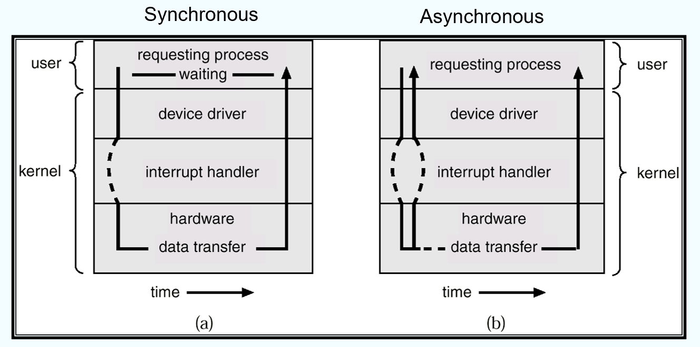

**Device-Status Table**

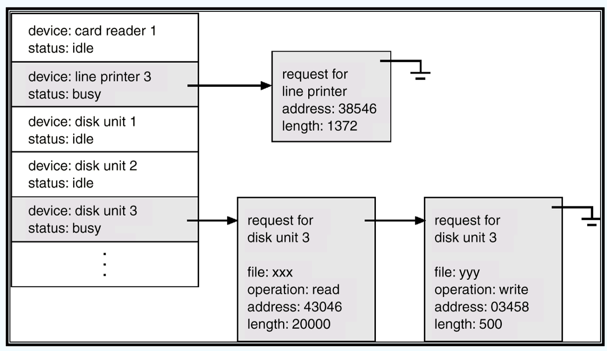

决定以何种顺序处理多个请求。

### Multiprocessor / Multicore System

多处理器：共享主存。

多核处理器：共享 L2 缓存。

**NUMA**

The CPUs are connected by a shared system interconnect.

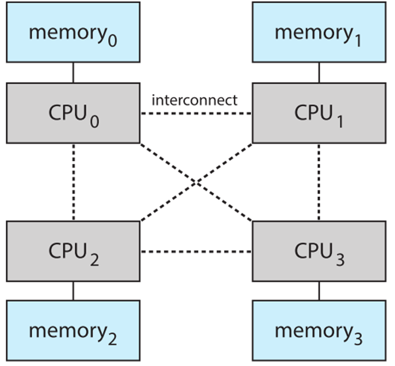

### 操作系统结构

**multiprogramming**：可以将多个程序存入主存进行运行，提高 CPU 的利用率。多道程序设计。

**timesharing (multitasking)**：多用户同时分享 CPU 资源，并可以得到相对应的相应。分时系统。

+ 使用 CPU scheduling 规划多程序同时运行。
+ 使用 Swapping 使得大规模的程序 (大于内存空间)，可以运行。
+ 使用 virtual memory 可以程序不完全在内存中运行。

操作系统会有两个 mode。如 User mode 和 kernel mode，用硬件上的一些 bits 进行表征。

+ 一些特权指令只能在 kernel mode 下运行。
+ 两种 mode 进行了隔离，不能同时处在两种状态。

以下为两种模式之间的切换步骤：

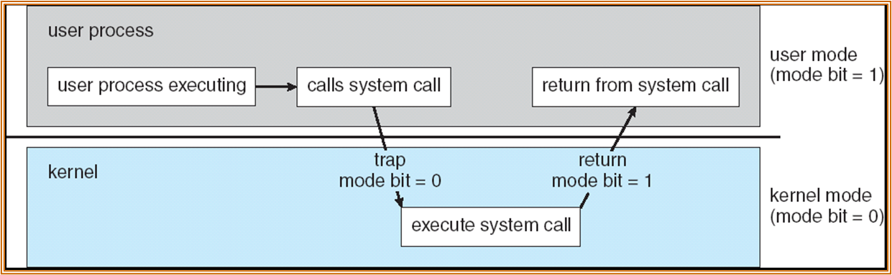

call system call 是一种软中断，也称 trap。实际上为程序为用户态提供了一系列的 API。

### 进程管理

进程是指一个程序的执行。程序是一个被动的实体，进程是一个积极的实体。

进程是资源的集合：CPU、内存、I/O、文件、程序的状态数据。

进程又可以分为多个线程，每个线程都会有一个 Program Counter。

CPU 的复用，指的就是多个程序并发地运行。可以分为时分复用和空分复用。

进程种需要解决许多问题，如：进程的同步、交流、创建、删除、防止死锁等。

### 内存管理

**一般情况下**，在运行程序时，数据和指令都需要在内存之中。

进程管理的内容：记录内存的使用状态、内存分配与回收、决定各个进程的内存使用。

### 储存管理

操作系统提供了统一、逻辑的信息存储视图。

储存的单元为文件，每种存储介质均被设备管理。

文件系统中：

+ 可以使用目录结构进行管理。
+ 进行文件访问的管理与控制。

大文件管理中：

+ 通常使用硬盘进行存储。
+ 由操作系统进行管理，进行存储分配和磁盘调度。操作系统的运行速度高度依赖于磁盘调度算法。

==操作系统的目的：抽象 (系统调用)、复用、隔离、共享 (多进程、多用户)、安全、性能、功能==

## OS 结构

> 2023 / 09 / 26

### OS Services

+ **User interface** (UI)：分为 GUI 和 CLI。
+ **Program execution**：包括用户程序和系统程序，能够处理报错。
+ I / O、File system、错误处理、资源分配……

### System Calls

用户模式进入系统模式的唯一方式，trap。

相较 API (Application Program Interface)，system call 更加底层。

POSIX API：Unix、Linux、MacOS 的通用标准，提供系统调用接口。

每种 system call 会被编号。被记录在一张表中，放在 system-call interface。

User 中调用：

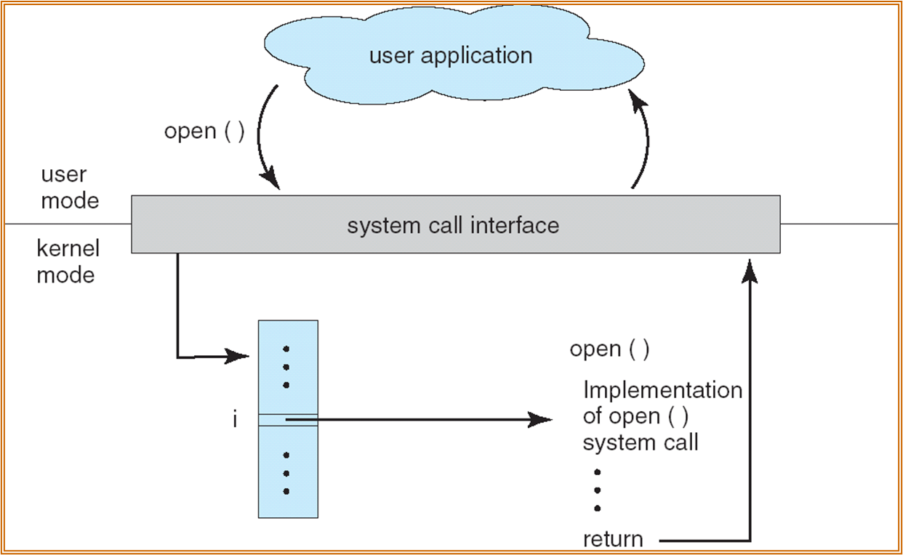

高级语言中调用：

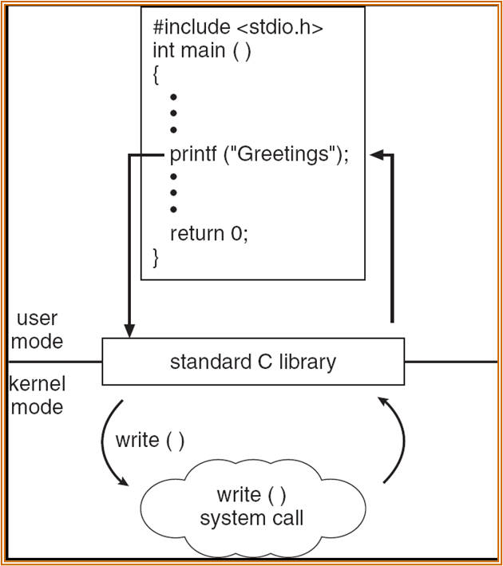

都是通过某个 interface 实现状态转换。

内核中 system call 的具体实现向上层封装，可以增加其可移植性。

**参数传递**

+ 寄存器传递，最为简单的方式。

+ 参数较多时，可以存在一个内存中的 Block 或者 table 中，将 Block 或 table 的地址通过寄存器传递。需要注意的是可能传递的地址为虚地址 (两种态之间的传递)，需要经过转换。

  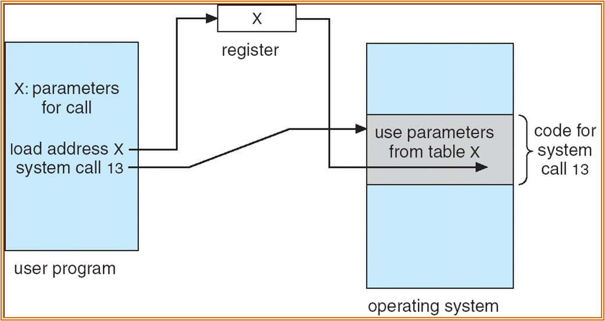

+ 通过栈进行传递。但是栈在两种态下不一定能够共享，该方法不适用于所有的系统。

**分类**：进程管理 (创建 child pid-等待-退出)、文件管理、设备管理、信息维护 (如获取 pid)、交流、权限保护。

### 操作系统的设计和实现

设计的原则：What will be done? 策略 Policy。How to do it? 机制 Mechanism。需要将 Policy 和 Mechanism 分离。

#### 分层结构

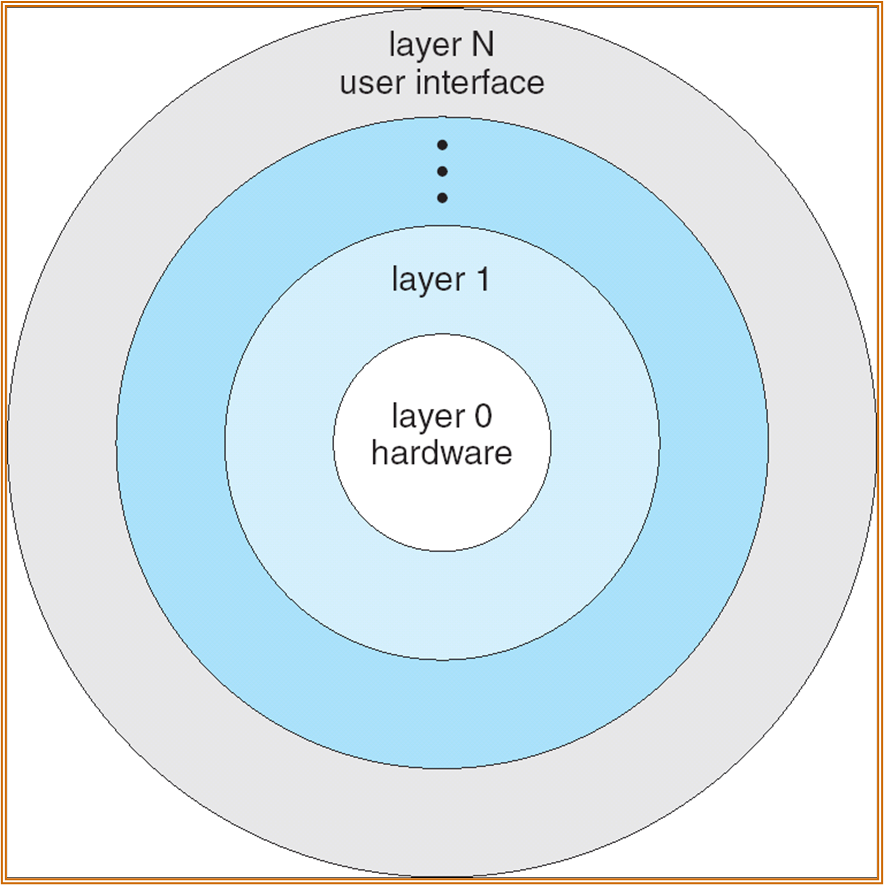

但这只是概念模型，实际上不同层级之间仍存在嵌套。

以下为 UNIX 的系统分层概念图。

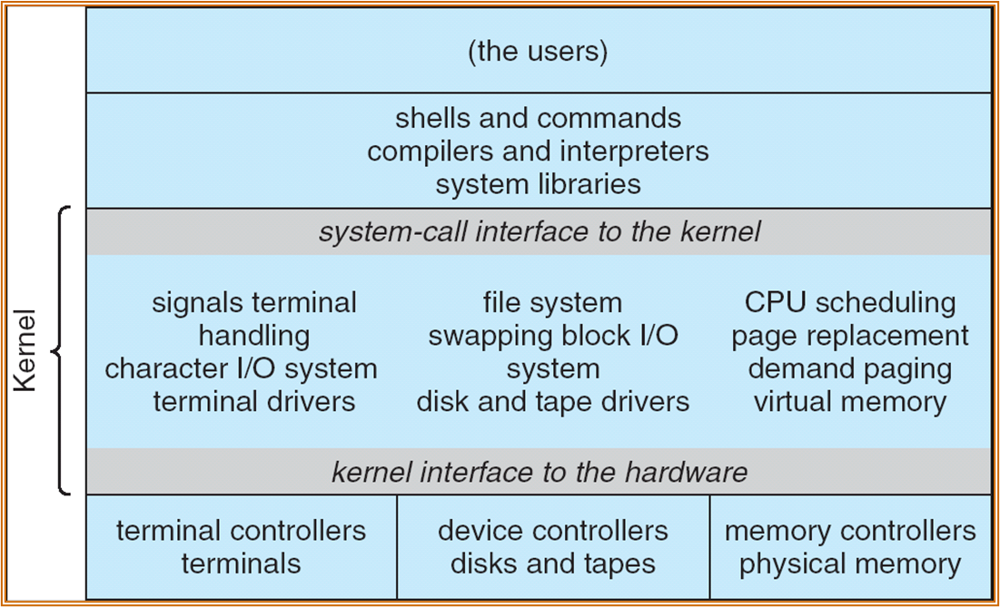

UNIX 为宏内核结构。对应的微内核 (仅实现基本的功能)，示意如下：

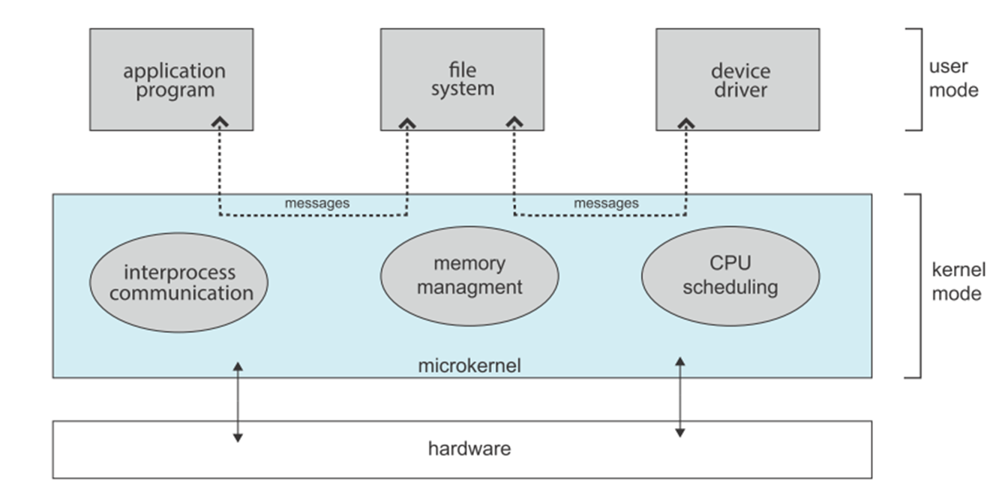

相比宏内核，许多程序需要在 User Mode 中实现。微内核有时需要通过进程通讯实现操作，效率相比宏内核可能降低。但微内核较为稳定、容易移植等。

现代的操作系统也会使用**内核模块 (LKM)** 这种机制 (Linux 为宏内核，但采用了模块化 + 动态加载的机制)。

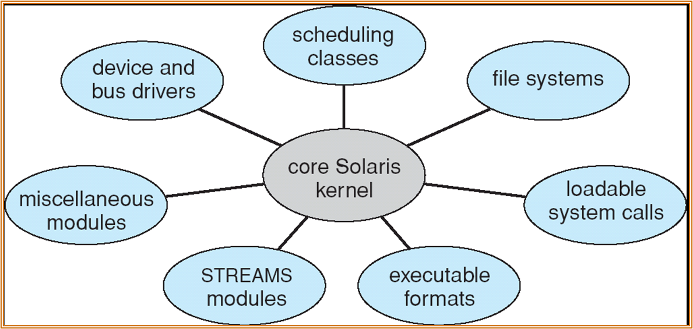

可以在需要使用时加载对应的模块到 kernel。

**Exokernel**：外核，内核高度简化，只负责资源分配和低级的硬件操作，必须使用定制的库供上层应用使用。

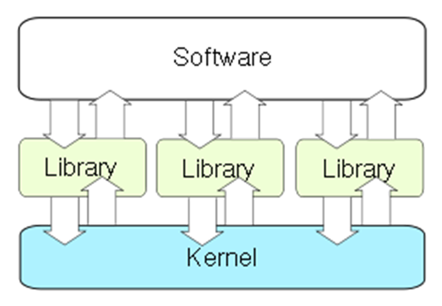

与微内核的区别在于，通过库而不是消息传递进行程序调用。存在兼容性问题，对于定制库文件不统一，维护难度较高。

### 虚拟机

virtual-machine implementation，也称 hypervisor。

两种虚拟机的方案：Type 1 (bare-metal，虚拟机直接和硬件交互)，type 2 (host，虚拟机依赖于宿主系统)

## 进程

> 2023 / 10 / 07

### 概念

进程：一个正在执行的程序，且需要是被顺序执行。

一个进程由以下几个 sections 组成：

+ text section (程序段、代码段)
+ data section (全局变量)
+ program counter
+ 栈 stack (函数参数、局部变量、返回地址) (地址从高到低)
+ 堆 heap (动态分配的内存) (地址从低到高)

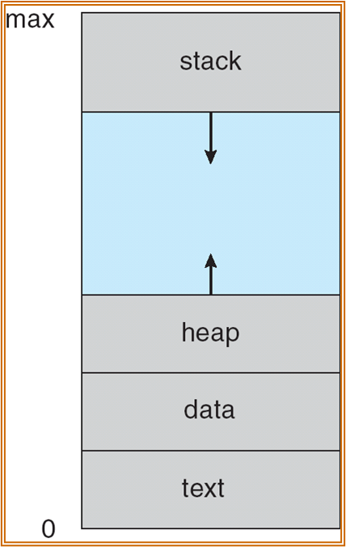

此处的地址为虚拟地址而非物理地址。实际上进程所使用的空间，只有 max 端以及 0 段一小部分的空间，中间大部分不用的空间称为 hole。

==user code 和 kernel 不使用同一个 stack，每个进程都有自己对应的 stacks，以获得更好的隔离性==

### 状态

一个进程有以下几种状态：

+ new：正在被创建
+ running：指令正在被执行
+ waiting：进程在等待 (或 blocked) 一些事件 / 响应 (例如等待键盘响应、磁盘操作完成)
+ ready：进程等待**处理器**进行处理 (可能 CPU 处于非空闲状态)
+ terminate：任务完成

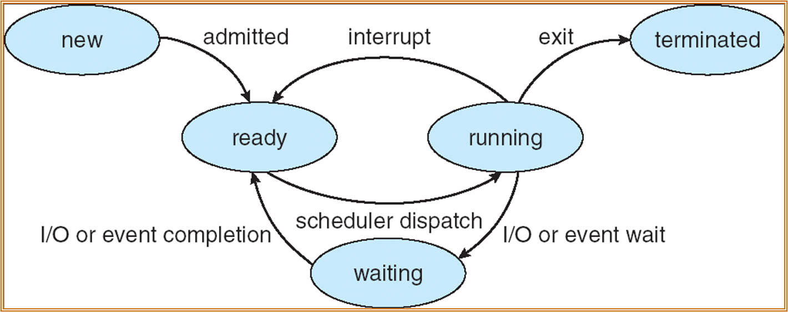

### Process control block (PCB)

需要记录进程的状态、调度以及其他重要信息 (现场)。

PCB 需要创建一种数据结构，其中具体需要记录的部分信息有：Process state、Program counter、Contents of CPU registers、CPU scheduling information、Memory-management information、Accounting information、I/O status information

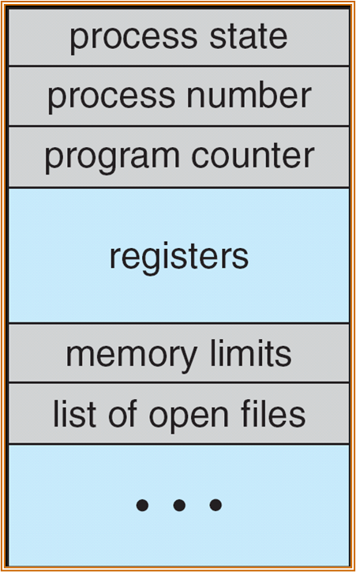

进程调度时需要保存进程的上下文，使等待结束后的进程可以正常运行。

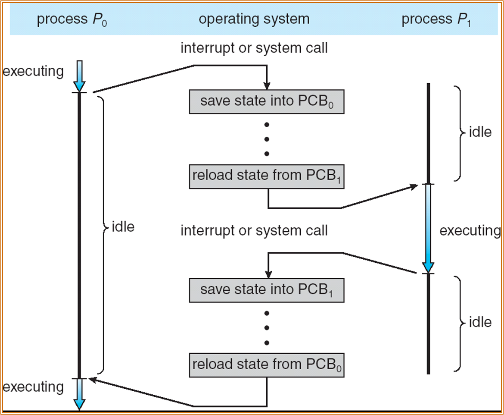

PCB 存储在 kernel stack 中。

#### 调度队列 Process Scheduling Queues

+ 任务队列 **Job queue** – set of all processes in the system

+ 就绪队列 **Ready queue** – set of all processes residing in main memory, ready and waiting to execute

+ 设备队列 **Device queues** – set of processes waiting for an I/O device，可能会有多个，每个设备对应一个队列

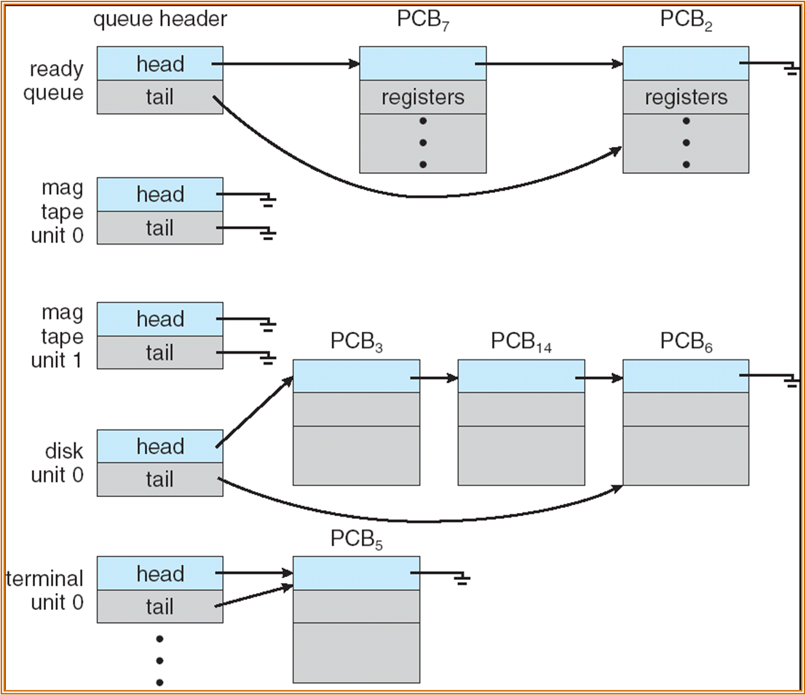

ready queue 实际上也是 CPU queue。

一个 PCB 一次只能出现在一个队列上。程序被顺序执行，而程序要使用 device 只能使用 system call。

一个进程被 timer interrupt 打断，会被重新放入 ready queue。

Job queue 会链接所有的进程，上图中未绘出。

进程会在 queue 之间迁移 migrate。

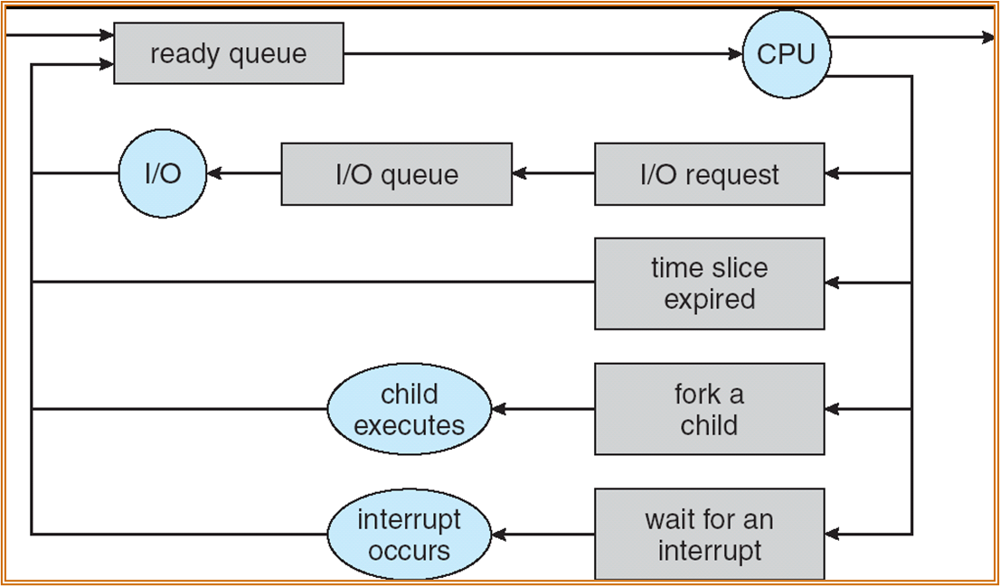

#### Schedulers

+ **Long-term scheduler** (or job scheduler) – selects which processes should be brought into memory (the ready queue)
+ **Short-term scheduler** (or CPU scheduler) – selects which process should be executed next and allocates CPU

当下，用户取代了 long-term scheduler 的角色。

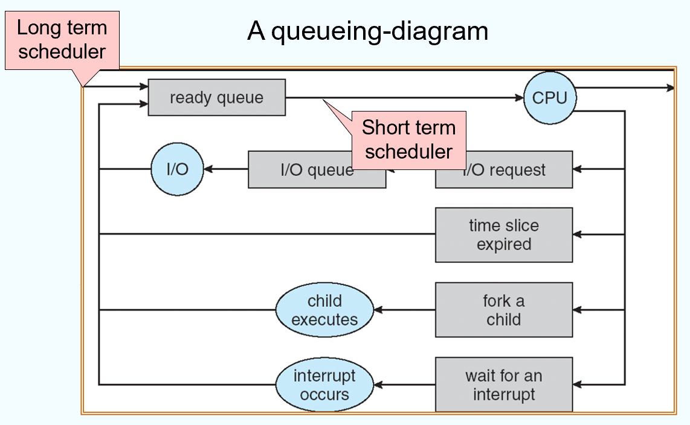

一般考虑 short-term。

进程 schedule 的速度需要尽量快以减少进程调用的 overhead 时间。

此外还有 **medium-term scheduling**，也称 **swap-in, swap-out**。当内存中的进程占用的空间过多时，需要对内存进行管理。

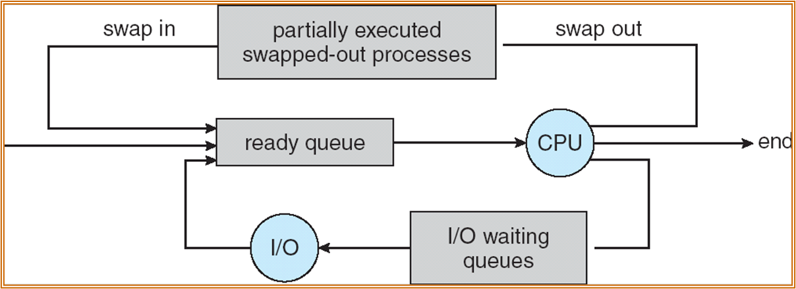

short-term scheduler 调用非常频繁。约 10 ms 就需要 timer interrupt 进行调度，是为了保证良好的交互性。

+ I/O 绑定，**I/O-bound process** – spends more time doing I/O than computations, many short CPU bursts

+ CPU 绑定，**CPU-bound process** – spends more time doing computations; few very long CPU bursts

#### Context Switch

上下文切换，切换不同的进程。

上下文切换时会 overhead，此时系统不可用。

### 进程创建

父进程可以创建子进程，子进程还可以创建自己的子进程，会形成一颗进程树。

+ 父进程和子进程之间可以选择共享资源的范围 (从共享全部资源到不共享)。

+ 父进程和子进程可能并发进行也可能父进程等待子进程完成。
+ 子进程和父进程的地址空间可能是复制关系 (Linux)，也可以由程序加载。

在 UNIX 中：

+ **fork** system call creates new process

+ **exec** system call used after a **fork** to replace the process’ memory space with a new program

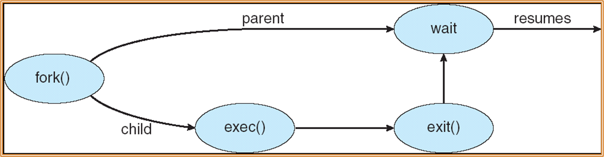

父进程的 pid 为 1 的进程称为 orphan 进程。

一个 fork 的例子如下：

~~~c++
int main()
{
	pid_t  pid;
	/* fork another process */
	pid = fork();
	if (pid < 0) { /* error occurred */
		fprintf(stderr, "Fork Failed");
		exit(-1);
	}
	else if (pid == 0) { /* child process */
		execlp("/bin/ls", "ls", NULL);
	}
	else { /* parent process */
		/* parent will wait for the child 	to complete */
		wait (NULL);
		printf ("Child Complete");
		exit(0);
	}
}
~~~

一个进程树的示意如下：

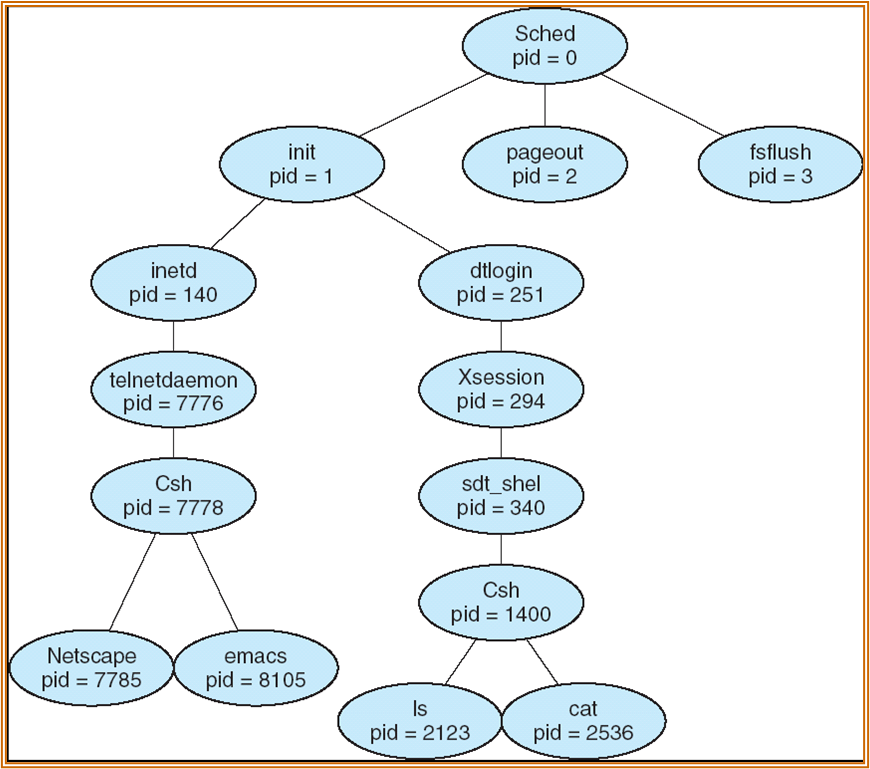

### 进程终止

分为 exit 和 abort，根据不同的操作系统设计，父进程可能会影响子进程的运行。(linux 不影响)

### 进程的合作与通信

进程通信可以实现信息共享、计算加速、模块化设计。

**Producer-Consumer Problem**

producer process 生产信息，由 consumer process 使用，需要通过 buffer 实现信息的传递。

+ unbounded-buffer：传递信息远小于 buffer 空间。
+ bounded-buffer：buffer 的空间可能会被完全使用。

~~~c++
// shared data
#define BUFFER_SIZE 10
typedef struct {
	. . .
} item;

item buffer[BUFFER_SIZE];
int in = 0;
int out = 0;

// producer / insert
while (true) {   
    Produce an item;
    while (((in + 1) % BUFFER_SIZE == out){}
    /* do nothing -- no free buffers */
    buffer[in] = item;
    in = (in + 1) % BUFFER_SIZE;
}

// consumer / remove
while (true) {
    while (in == out){} //do nothing, nothing to consume
    Remove an item from the buffer;
    item = buffer[out];
    out = (out + 1) % BUFFER_SIZE;
    return item;
}
~~~

**Interprocess Communication IPC**

有两种方式：shared memory 和 message passing。

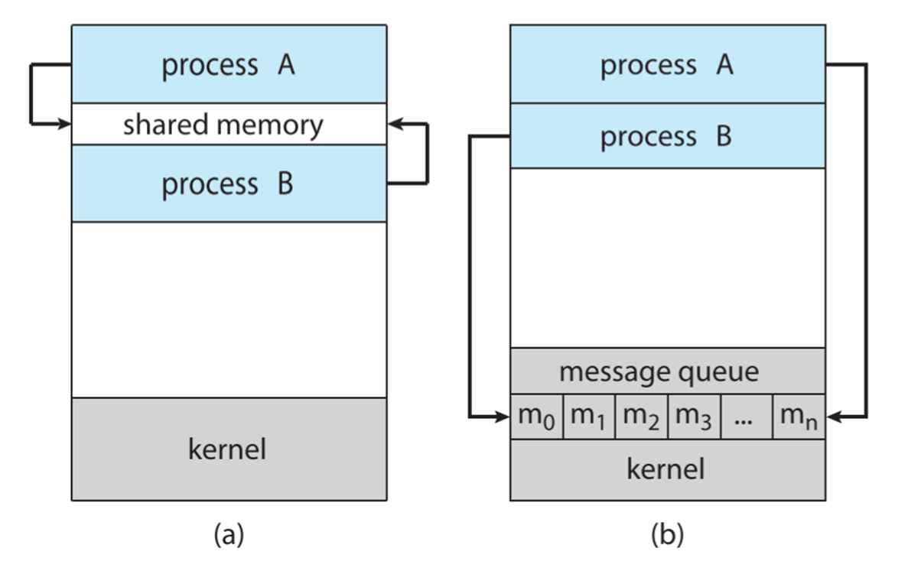

对于 message passing 这一方式，可以分为 Direct Communication，Indirect Communication。

直接通讯会自动建立两个进程之间的通讯。

Indirect Communication 则会从特定的 mailbox (也称为端口) 中传输信息。

信息传递也可以分为同步和异步的。其中同步意味着需要进行 blocking 的操作。

收发消息时需要建立一个消息队列 (buffer)，当 buffer 的容量为 0  时，发送者必须等待接收者。如果容量是 bounded 的，如果 buffer 满了，sender 也需要等待。如果是 unbounded 则无需等待。

## 线程

> 2023 / 10 / 17

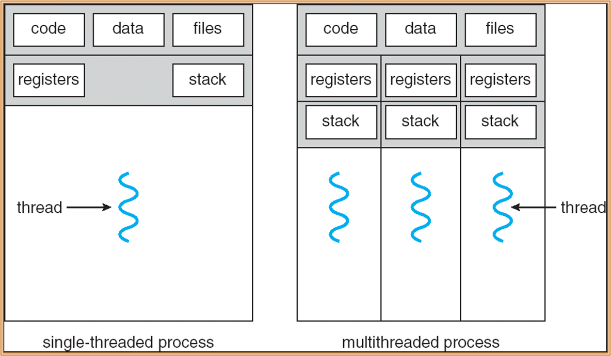

每个线程都代表这一个运行中的 context，有独立的寄存器和栈。不同的线程之间共享代码段、数据、文件。

多线程可以提升软件的响应性与交互性，可以节约、共享资源、提升并发性，更好地适配多核的架构。

### User Thread & Kernel Thread

线程的实现可以只在用户态中实现 (所有 progress，kernel 均视为单线程)。或也可以在内核态下实现。

#### multithreading model

如何实现多线程。

+ many-to-one：多个用户层面的线程最终被映射到了单个内核层面的线程。单个线程的 blocking 会造成所有线程的 blocking。

  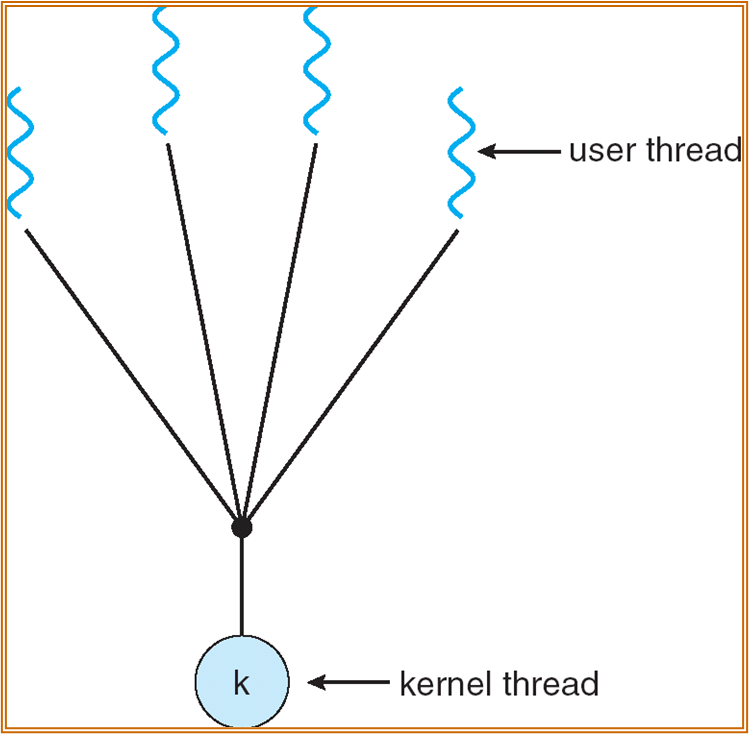

+ one-to-one：用户态中创建一个线程，对应地，内核态中也创建一个线程。但若一个进程创建了过多的线程，会影响到系统的运行效率。

  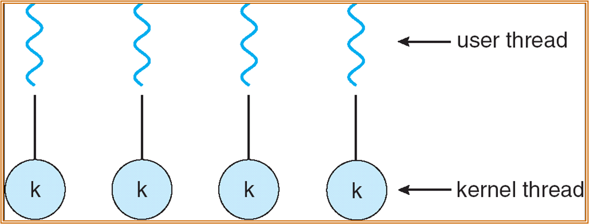

+ many-to-many：内核态中有多个线程，但是不会无限多。

  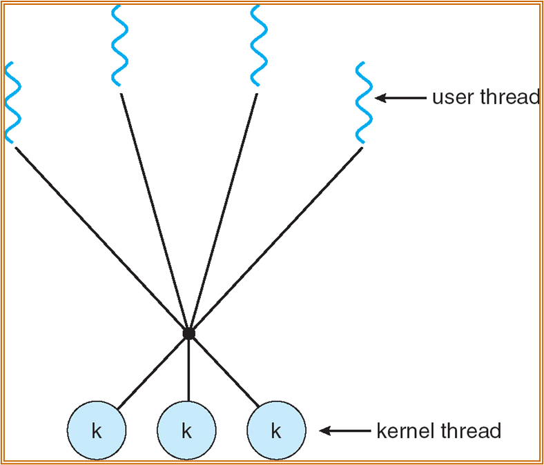

+ Two-level model：不同的线程重要度不同，对重要的线程使用 one-to-one，非重要线程使用 many-to-many。

  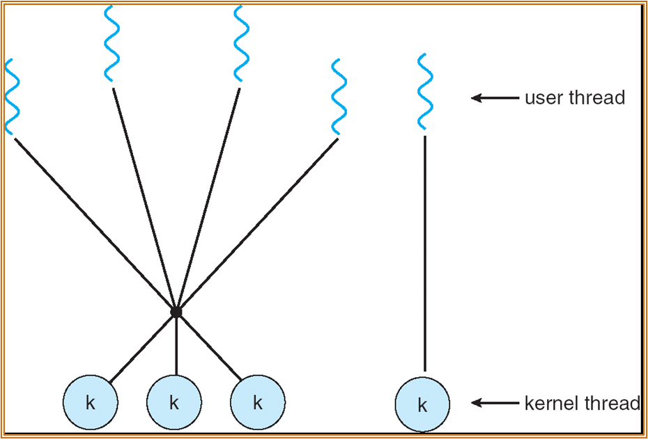

#### signal handling

signal 与 interrupt 的不同在于：interrupt 由 CPU 处理，signal 是一种 IPC 的方式，用于协调 signal 的是 kernel，处理 signal 的每个进程的 signal handler。

#### Thread Pools

线程池。希望对于 process request 的响应能够尽量快。非线程池情况下，响应 request 的流程为收到 request - create thread - 处理 - cancel thread。线程池会直接创建多个线程，收到 request 直接查找空闲线程进行调用。

线程池的大小取决于程序提供的 service 的容量。

#### Scheduler Activations

调度激活。保证 APP 始终可以运行指定数目的 thread。

## CPU 调度

> 2023 / 10 / 19

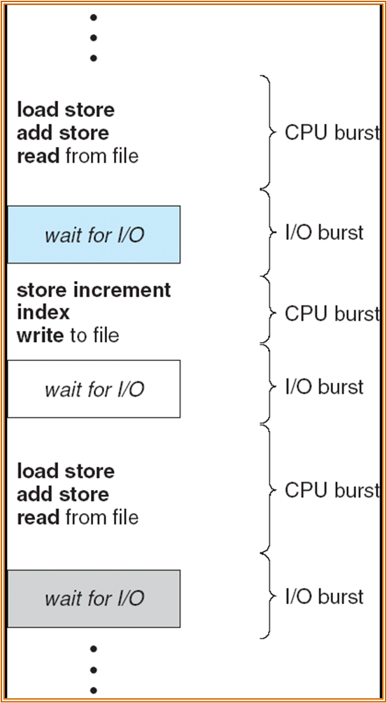

实际上 CPU burst 的时间很短，而 I/O 的时间很长。为提高 CPU 的利用率，需要进行 multi-programming。

CPU Scheduler 在以下的场景中会起作用：

+ 一个进程从 running 进入到 waiting 状态 (I/O 请求或 wait())。
+ 一个进程从 running 进入到 ready 状态 (中断)。
+ 一个进程从 waiting 进入到 ready 状态 (I/O 完成)。
+ 一个进程运行结束。

!!! note
	以上的情况中，1、4 两种情况是 preemptive，2、3 为 nonpreemptive。

### Dispather

将 CPU 的运行时间分派给各个进程。

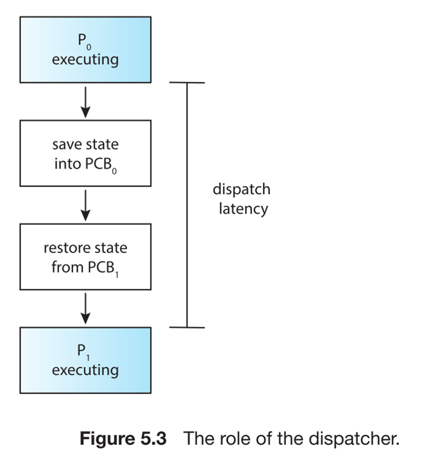

+ Dispatcher module gives control of the CPU to the process selected by the short-term scheduler; this involves:

  + switching context

  + switching to user mode

  + jumping to the proper location in the user program to restart that program

+ *Dispatch latency* – time it takes for the dispatcher to stop one process and start another running。

!!! note
	Dispatch latency 对于 program 来说是 overhead。

### 调度 / 优化 Criteria

调度效率相关的指标有：

+ CPU utilization (CPU利用率) – keep the CPU as busy as possible

+ Throughput (吞吐率) – # of processes that complete their execution per time unit

+ Turnaround time (周转时间) – amount of time to execute a particular process (从提交到结束运行的全部时间)

+ Waiting time (等待时间) – amount of time a process has been waiting **in the ready queue**

+ Response time (响应时间) – amount of time it takes from when a request was submitted until the ***first* response** is produced, **not** output (for time-sharing environment)

优化时需要达到：

+ Max CPU utilization

+ Max throughput

+ Min turnaround time 

+ Min waiting time 

+ Min response time

### 调度算法

#### Gantt Chart

如上图所示，为 Gantt Chart 的一种。横坐标为时间轴。

#### First-come, First-served FCFS

最为基础的算法，先来的进程先处理。

|                                                              |                                                              |
| :----------------------------------------------------------: | :----------------------------------------------------------: |
|  | 平均等待时间： P1 = 0  P2 = 24  P3 = 27 P~avg~ = 17 P3 的周转时间是 30 |
|  |  平均等待时间： P1 = 6  P2 = 0  P3 = 3 P~avg~ = 3  |

#### Shortest-Job-First SJF

对于每个进程，记录下一次 CPU burst time，优先运行时间最短的程序。

分为两种情况：抢占式与非抢占式。

对于非抢占式的调度，调度的时机是在某一进程结束运行时，从当前的 ready queue 中找出时间最短的进程。

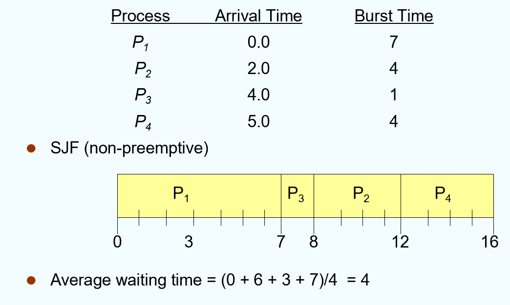

!!! warning
	以上的等待时间计算时，需要减去 arrival time。

对于抢占式的调度，调度的时机是新进程到达的时间 / 进程运行结束的时刻，选择剩余 burst time 最短的进程进行调度。

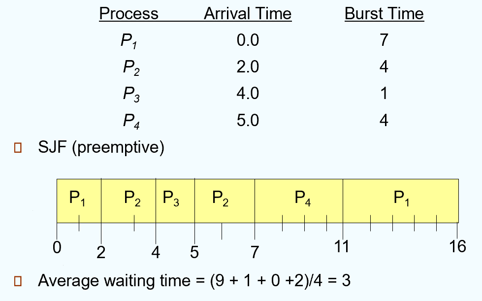

!!! warning
	以上的等待时间计算时，需要考虑被打断后的等待时间，例如 P~1~ 在调度的中间存在 9 的等待时间。

!!! note
	SJF 调度是理论上最优的调度方案。
	但是不可测量 next CPU burst time，需要使用一定的估计方法。例如下图中的方法使用过去的调度时间来估计未来的调度时间。
	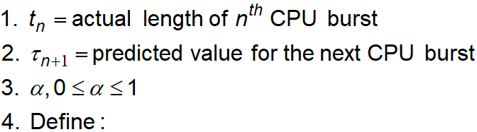

#### Priority Scheduling

此处定义编号 (priority number) 越小，优先级越高。

从本质上看，SJF 也是一种 priority scheduling。

+ Problem $\equiv$ Starvation – low priority processes may never execute. 低优先级的进程永远得不到运行。

+ Solution $\equiv$ Aging – as time progresses increase the priority of the process. 随着时间的推移增加等待的进程的 priority。

#### Round Robin RR

面向交互式系统 / 分时系统 (多任务系统) 。

每个进程都分配一个时间单元 (time quantum, q)。若 ready queue 中有 n 个进程，某进程最多等待 (n-1) * q 的时间就会得到调度。

!!! note
	q large -> FIFO
	q small -> q must be large with respect to context switch, otherwise overhead is too high

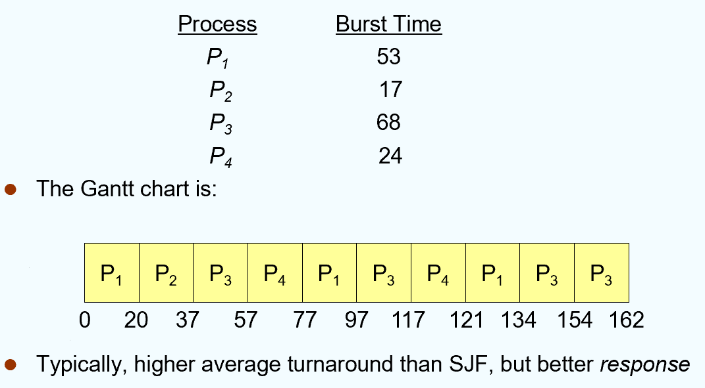

相比 SJF，可以发现虽然 SJF 的总运行时间短，CPU 效率高，但是相应时间可能不一定优于 RR。

#### Multilevel Queue

Ready Queue 被分为两个队列，前台 (foreground) 以及后台 (background) 两个队列。每个队列有自己的调度算法。

要较好实现需要解决两个问题：

+ 两个队列之间的优先级问题 (例如，是否均为前台应用的优先级高于后台应用)。
+ 两个队列的 CPU 时间的分配 (time slice)。

#### Multilevel Feedback Queue

带反馈的多层队列。例如某一进程在 RR 调度下尚未完成运行，则调度程序会将其切换到另一个队列中继续运行。

原先静态的多级队列可能会导致一些 starving 问题，而“游走”可能可以解决这个问题。

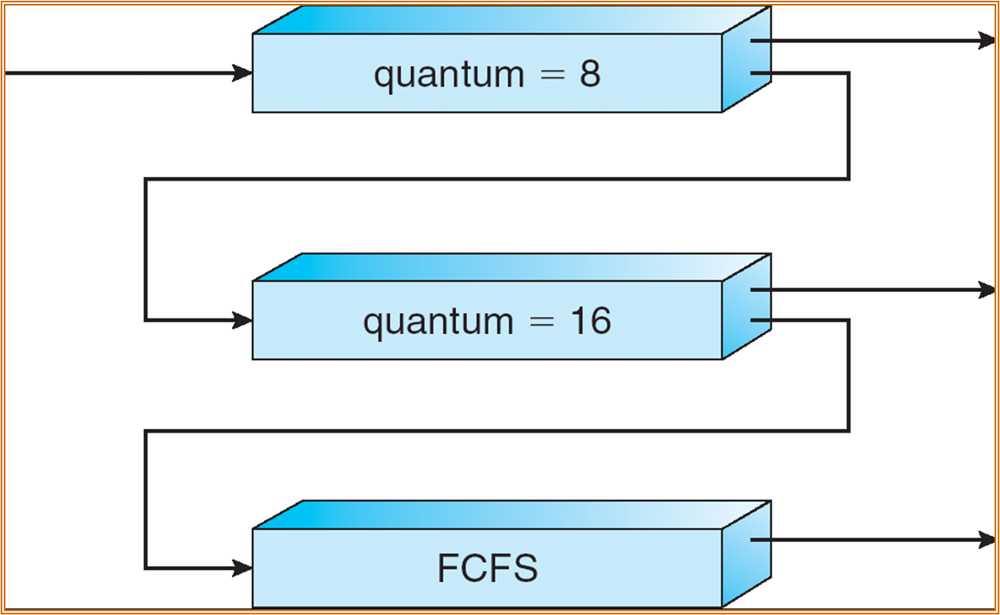

### 线程调度

也称为 contention scope。

+ **Local Scheduling** (**Process**-Contention Scope) – How the threads library decides which thread to put onto an available LWP.

+ **Global Scheduling** (**System**-Contention Scope) – How the kernel decides which kernel thread to run next.

## 进程同步

> 2023 / 10 / 26

### Race Conditon

在之前的 producer-consumer 模型中加入共享变量 count 记录队列中元素的个数。producer 中 ++，consumer 中 --。

具体实现为：

`register1 = count  register1 = register1 + 1  count = register1`

`register2 = count  register2 = register2 - 1  count = register2`

若经过调度后顺序如下：

1. S0: producer execute register1 = count   {register1 = 5}
2. S1: producer execute register1 = register1 + 1   {register1 = 6} 
3. S2: consumer execute register2 = count   {register2 = 5} 
4. S3: consumer execute register2 = register2 - 1   {register2 = 4} 
5. S4: producer execute count = register1   {count = 6 } 
6. S5: consumer execute count = register2   {count = 4}

count 的值不符合期望。

**Critical Section**：可能由于共享内存产生冲突的部分 (但也存在不访问共享内存的部分)。大致的模型如下：

~~~c
do {
    /* Entry section here */
    // Critical section
    /* Exit section here */
    // Remainder section
} while(TRUE);
~~~

若 Critical section 中的 statements 若在操作不同的 data item，可以将其分解为更细粒度的 critical section。细粒度的 critical section 可以有更好的并发性。

Critical section 需要满足三个条件：

**互斥性** (mutual exclusion)，若一个进程在运行 critical section，与该进程存在合作关系的进程不可运行。

**Progress**，如果当前合作的进程中，没有进程处于 critical section 中，存在接下来希望进入 critical section 的几个进程，需要保证进程进入 critical section 不会被永久延迟 (有限时间内选择出执行 critical section 的进程)。

**有限等待** (Bounded Waiting)，一个进程发出请求执行 critical section (已经进入 entry section)，需要等待的时间一定是有限的。

+ 假设每个进程运行速度一定非 0。但无进程间相对运行速度的假设。

软件方法 -- **Peterson's Solution**

~~~c++
int turn; 
Boolean flag[2];
// for P_i (另一个进程为 P_j, 类似)
while (true) {
    flag[i] = TRUE;
    turn = j;
    while ( flag[j] && turn == j);
    	// CRITICAL SECTION
    flag[i] = FALSE;
    	// REMAINDER SECTION
}
~~~

硬件方法：**关闭中断** (若 critical section不能正常执行，中断无法开启；多核或多处理器的情况下，关闭中断代价较高)，**Atomic 指令** (执行时不允许中断)。

**TestAndSet solution**

~~~c
boolean TestAndSet (boolean *target) {
    boolean rv = *target;
    *target = TRUE;
    return rv:
}
while (true) {
    while (TestAndSet(&lock))
        ;   /* do nothing */
    // critical section
    lock = FALSE;
    // remainder section 
}
~~~

但是以上的方法不满足有限等待，可能会产生 starving 的问题。例如进程 1 3 互相抢占，进程 2 starving。

**Swap Instruction**

~~~c
void Swap (boolean *a, boolean *b) {
    boolean temp = *a;
    *a = *b;
    *b = temp:
}
while (true)  {
    key = TRUE;
    while ( key == TRUE)
        Swap (&lock, &key );
    // critical section
    lock = FALSE;
    // remainder section 
}

~~~

与 TestAndSet 类似，依然不满足有限等待。

### Semaphore

semaphore S 为一个整型变量。

有两个基础的 atomic 操作：wait() 和 signal()。

~~~c
S.wait() { 
while S <= 0
	; // no-op
S--;
}
~~~

~~~c
S.signal() { 
	S++;
}
~~~

若有多个进程同时处于 wait 的循环之中，S 被置为 1，由于 wait() 是原子操作，则某一进程退出循环后将会将 S 重新置为 0，其余进程将继续等待。

+ counting semaphore：S 为整形变量。
+ binary semaphore (mutex locks) ：S 只能为 0 或者 1。

~~~c
Semaphore S;    //  initialized to 1
wait (S);
// Critical Section
signal (S);
~~~

Semaphore 可用于指定进程之间的调用顺序。

~~~c
Semaphore S;    //  initialized to 0
P1:	S1
    S.Signal()
P2: S.Wait()
    S2
~~~

以上场景中，希望 S1 在 S2 之前运行，将 S 初始化为 0，可以实现目的。

由于需要保证 Wait() 和 Signal() 不能同时执行，wait 和 signal 操作也需要作为临界区代码执行。一种执行方式是加锁，进行忙等待。

另一种方式是可以不使用忙等待，利用 OS 本身的上下文切换机制。

~~~c
wait (S){ 
    value--;
    if (value < 0)
        // add this process to waiting queue
        block();  
}
Signal (S){ 
    value++;
    if (value <= 0)
        // remove a process P from the waiting queue
        wakeup(P);  
}
~~~

使用信号量依然可能出现 deadlock 和 starving 问题。

### Some Problems

#### Bounded-Buffer Problem

+ Semaphore mutex initialized to the value 1

+ Semaphore full initialized to the value 0, counting full items

+ Semaphore empty initialized to the value N, counting empty items.

~~~c
// producer
while (true)  {
    // produce an item
    wait (empty);
    wait (mutex);
    // add the item to the  buffer
    signal (mutex);
    signal (full);
}
// consumer
while (true) {
    wait (full);
    wait (mutex);
    // remove an item from buffer
    signal (mutex);
    signal (empty);
    // consume the removed item
}
~~~

#### Readers-Writers Problem

有多个 Reader 和多个 Writer。读操作可以并发，但一旦有写操作，只能由当前需要写的进程进行访问。

+ Semaphore mutex initialized to 1, to ensure mutual exclusion when readcount is updated.

+ Semaphore wrt initialized to 1.

+ Integer readcount initialized to 0.

~~~c
// writers
while (true) {
    wait (wrt) ;
    // writing is performed
    signal (wrt) ;
}
// readers
while (true) {
    wait (mutex) ;
    readcount++ ;
    if (readcount == 1)  wait (wrt) ;
    signal (mutex);
    // reading is performed
    wait (mutex) ;
    readcount-- ;
    if (readcount  == 0)  signal (wrt) ;
    signal (mutex) ;
}
~~~

只有第一个 reader 需要进行 wrt 的 wait 和 释放。

#### Dining-Philosophers Problem

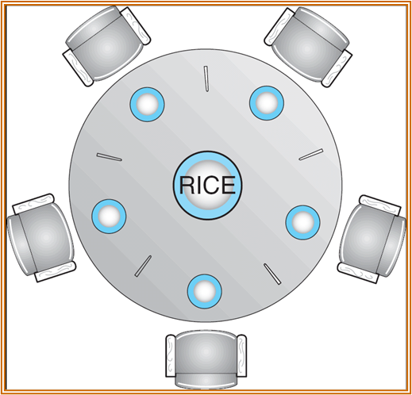

五个哲学家，5 **支**不同的筷子。只有当哲学家饥饿时，才会试图拿起自己左右两根筷子。

~~~c
// Philosopher i
While (true) { 
    wait (chopstick[i]);
    wait (chopStick[(i + 1) % 5]);
    //  eat
    signal (chopstick[i]);
    signal (chopstick[(i + 1) % 5]);
    //  think
}
// 上述代码可能发生死锁，当所有哲学家同时取同一侧的筷子时
~~~

只需要更改取筷子的顺序即可。一部分哲学家先取左侧的筷子，一部分先取右侧的筷子即可。

### Monitor 管程

一种高层抽象的机制，实现线程之间的同步。

~~~c
monitor monitor-name
{
	// shared variable declarations
    // Only one process may be active within the monitor at a time
	procedure P1 (…) { …. }
	…
	procedure Pn (…) {……}
    Initialization code ( ….) { … }
	…
}
~~~

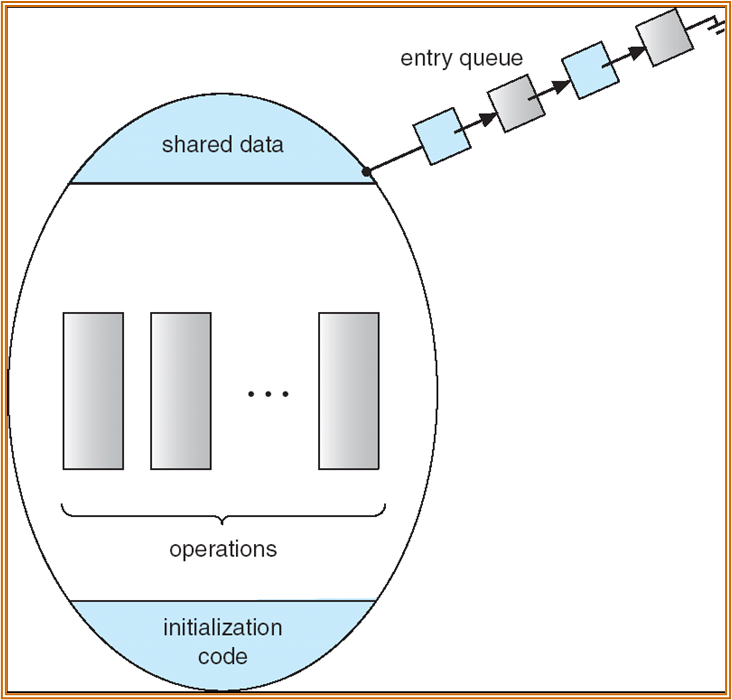

除了正在运行的程序，其他程序处于 Queue 中等待进入。

#### Condition Variable

一个进程进入管程后被阻塞，阻塞的原因定义为条件变量。原因可能有多个，故可能有多个条件变量队列。

+ Two operations on a condition variable:

  + **x.wait ()**  – x 条件不满足，正在调用 monitor 的进程使用该操作将自己插入 x 的等待队列，释放管程，其余进程也可进入。

  + **x.signal ()** – x 条件变化。调用该操作。唤醒一个被 x.wait() 阻塞的进程。

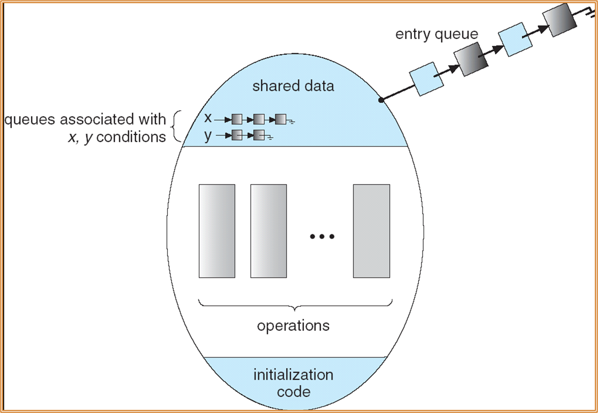

~~~c++
monitor Demo {
    共享数据结构 S;
    init() {...}
    take_away() {
        // 资源不够，在 x 上阻塞等待
        if(S <= 0) x.wait();
        // 资源足够，则进行处理
        ...
    }
    give_back() {
        //规划资源
        ...
        if(有等待进程) 
            // 唤醒进程
            x.signal()
    }
}
~~~

## 死锁

> 2023 / 11 / 09

由于多个进程的并发执行，多个进程因竞争造成一种互相等待的情况，若无外力干涉无法推进。

|  | 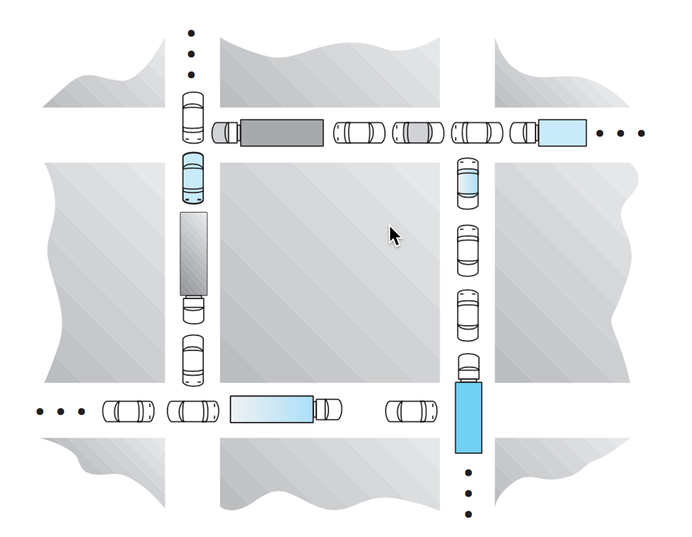 |
| :----------------------------------------------------------: | :----------------------------------------------------------: |

死锁的原因：存在资源的共享。

**系统模型**：

+ 有资源 R~1~ ~ R~m~，CPU cycles, memory space, I/O devices 等，每种资源有多个实例 W~i~
+ 遵循 request - use - release 协议

在上述的系统模型之下，死锁的条件为 (均需满足)：

+ **Mutual exclusion:** only one process at a time can use a resource.

+ **Hold and wait:** a process holding at least one resource is waiting to acquire additional resources held by other processes.

+ **No preemption:** a resource can be released only voluntarily by the process holding it, after that process has completed its task.

+ **Circular wait:** there exists a set {*P*0, *P*1, …, *P*n} of waiting processes such that *P*0 is waiting for a resource that is held by *P*1, *P*1 is waiting for a resource that is held by *P*2, …, *P**n*–1 is waiting for a resource that is held by *P*n, and *P*n is waiting for a resource that is held by *P*0.

### Resource-Allocation Graph

A set of vertices *V* and a set of edges *E*.

V is partitioned into two types:

+ *P* = {*P*1, *P*2, …, *Pn*}, the set consisting of all the processes in the system.

+ *R* = {*R*1, *R*2, …, *Rm*}, the set consisting of all resource types in the system.

request edge – directed edge *P*1 $\to$ *Rj*

assignment edge – directed edge *Rj* $\to$ *Pi*

|                           Process                            |                Resource Type with 4 instances                |
| :----------------------------------------------------------: | :----------------------------------------------------------: |
|  |  |
|              ***Pi* requests instance of *Rj***              |           ***Pi* is holding an instance of *Rj***            |
| 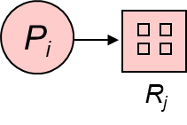 | 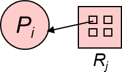 |

!!!warning
	+ 没有环路一定无死锁，有环路不一定有死锁
	+ 有环路：
	+ 	if only one instance per resource type, then deadlock.
	+	 if several instances per resource type, possibility of deadlock.

### 死锁处理

#### 死锁预防

使系统不会产生死锁的情况。使死锁的 4 个条件中有条件无法完成。

具体来说需要避免 circute wait 的产生：将所有的 resource type 都进行编号，使所有的资源只能序号从低到高地申请。但通常在现实地 OS 中不可能这样操作。

#### 死锁避免

仍属于预防范畴，但不是去避开死锁条件，而是防止进入系统“不安全状态”。

**系统安全状态**：在资源分配时检查是否安全。

+ 系统能按照某种顺序推进程序，并提供相应的资源，直至每个进程对资源的最大需求被满足。
+ 若找不到这样的序列，则说明系统不安全。
+ 不安全不一定死锁。

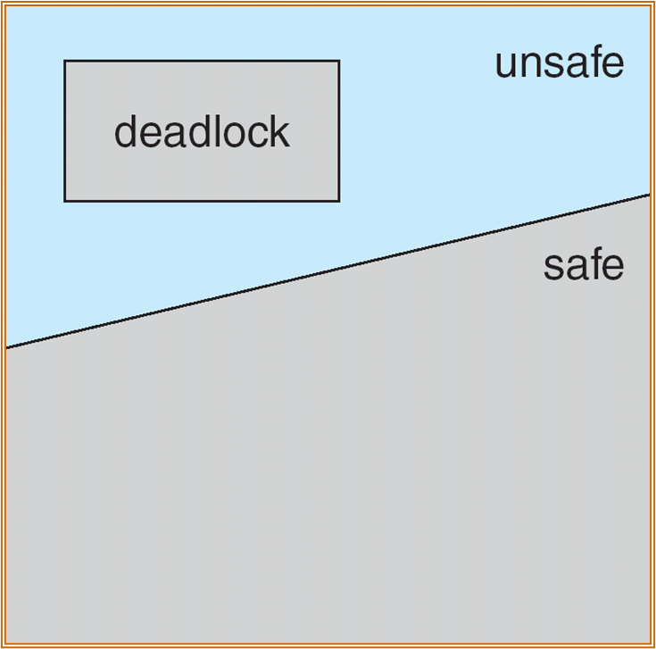

若每种资源只有一个实例，使用 RAG。

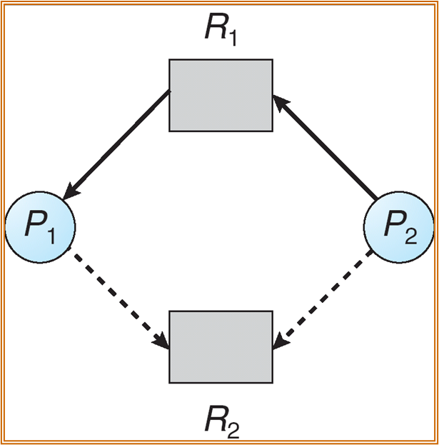

虚线为 claim edge 未来可能会 request。实线表示 request 和 assign。

每次分配时需要检查系统是否存在环路 (包括 claim)，若存在，需要拒绝最近的 request。

若每种资源有多个实例，使用 **banker's algorithm**。

将操作系统视为银行家，操作系统管理的资源相当于银行的资金。进程请求资源视为贷款。需要保证不出现资金短缺的情况。

有几点前提：

+ 每种资源有多个实例。
+ 每个进程事先声明了自己的最大资源使用量。
+ 申请资源时，进程有可能会等待。
+ 进程得到了需要的资源时，会在有限的时间内会归还资源。

***n*** = number of processes, and ***m*** = number of resources types

1. Avaliable 数组，表示各类资源的可用实例，若 Avaliable[j] = k，R~j~ 类型的资源有 k 个实例可供调用。
2. Max\[n]\[m] 矩阵，一行一个进程，一列一种资源，表示最大的需求量。
3. Allocation\[n]\[m] 矩阵，进程已经分配到的资源。
4. Need\[n]\[m] 矩阵，进程接下来最多还需要多少资源。

$Need[i,j]=Max[i,j]-Allocation[i,j]$

`Safety algorithm`

Work\[m] 表示剩余可用的资源，初始化为 Avaliable。

Finish\[n] 表示每个进程是否结束，一开始均设为 false。

1. 若存在 i 使得，Finish\[i] = false，Need[i] <= work，正常运行。若不存在，则转到第三步。
2. Work += Allocation，Finish[i] = true，回到第一步。
3. 若 Finish[n] 全是 true，系统处于安全状态。

`Resource-Request Algorithm`

Request~i~[m] 为进程 P~i~  的请求向量。

1. 若 Request~i~[j] <= Need[i, j]，跳转 2。若不是，视为出错。

2. 若 Request~i~[j] <= Avaliable[i, j]，跳转 3。否则进程需要等待资源。

3. 系统试探性地分配资源。

   $$ Avaliable = Avaliable - Request; \\ Allocation[i,j] = Allocation[i,j]+Request_i[j] \\ Need[i,j] = Need[i,j]-Request_i[j] $$

4. 使用 Safety Algorithm 检查是否安全，若安全，则分配；不安全，则回退。

#### 死锁检测

**Wait-for Graph**

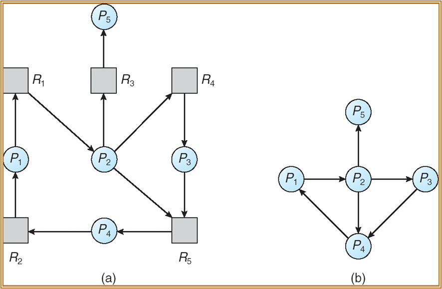

单实例地情况下若 Wait-for graph 中存在有向环路，则有死锁。

**多实例检测**

1. Avaliable[m]
2. Allocation\[n][m] 当前的分配情况。
3. Request\[n][m] 当前的请求情况。

Work\[m] 表示剩余可用的资源，初始化为 Avaliable。

Finish\[n] 表示每个进程是否结束，一开始，若 Allocation[i] == 0，则设为 true，不然为 false。

Detection Algorithm 如下：

1. 若存在 i 使得，Finish\[i] = false，Need[i] <= work，正常运行。若不存在，则转到第三步。
2. Work += Allocation，Finish[i] = true，回到第一步。
3. 若 Finish[i] == false，则进程 P~i~ 死锁。

#### 死锁恢复

+ Abort all deadlocked processes.
+ Abort one process at a time until the deadlock cycle is eliminated.

## 主存

> 2023 / 11 / 16

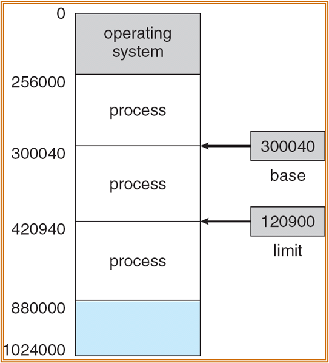

使用 Base 和 Limit 寄存器，表示一个进程的进程空间。

### Addressing

一般的地址表示为整数形式 (absolute address)，此外，地址还可以表示为：

+ Symbolic Address：主要用于高级编程语言，地址可以与变量相关联。例如数组名就表示一个地址。
+ Relocatable Address：可重定位地址，相对某个 module 的地址。当 module 落实到一个实际地址中时，Relocatable address 也会落实到实际地址。

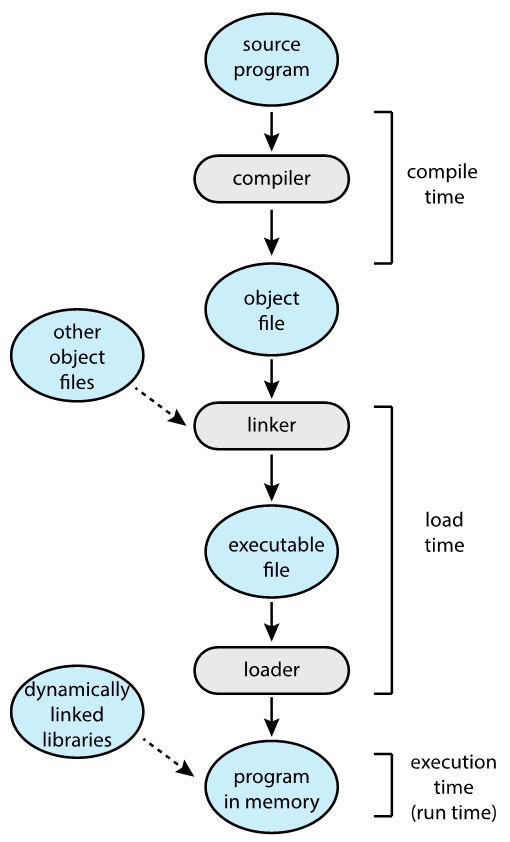

在 Compile 阶段主要使用 Relocatable address，目的是方便后续进行文件链接。

在 Linker 阶段，链接多个 .o 以及库文件，输出可执行文件。

执行阶段，映射到绝对地址。

#### 地址绑定

何时确定实际地址：

+ Compile time / Load time / Execution time
+ 现代操作系统大多在 Execution 阶段进行映射。允许程序在内存中移动。
+ DOS 在 Compile time 进行地址映射，即直接将代码中的 symbol 转化为实际地址。
+ Load time 在加载程序到内存时确定地址映射。但程序运行之后地址不会发生改变。

Execution time 阶段映射需要 CPU 硬件的支持，需要实现逻辑地址 (虚拟地址) 和绝对地址 (物理地址) 的分离。

**Logical Address**：又称为 Virtual address。由 CPU 指令中产生。

**Physical Address**：内存中的实际地址。

对于在 Compile 和 Load 阶段进行地址绑定的操作系统，逻辑地址和物理地址没有区别。

对于 Execution time 进行需要一定的方式进行二者之间的转化。一般使用 MMU (Memory-Management Unit)，进行硬件转化。

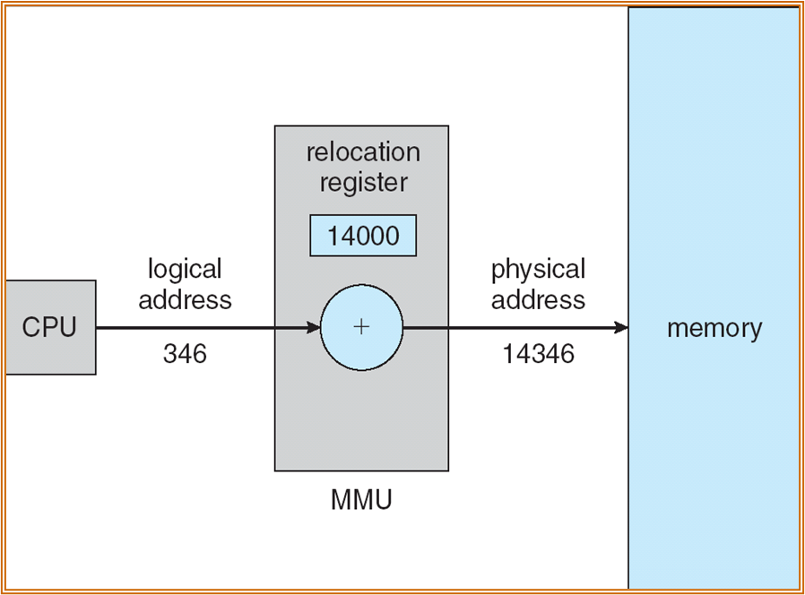

通过重定位寄存器，将逻辑地址加上一个偏移值，转化为一个物理地址。

!!!note
	`Dynamic Loading` 
	允许进程代码不完全加载，仅加载需要使用的模块。减轻系统的内存压力。 
	`Dynamic Linking` 
	链接的时候不需要链接所有的文件 (不用链接动态链接库)。使用桩模块 (stub) 代替原先的函数体，桩模块会找到对应的函数体进行运行。 

### Contiguous Allocation 连续 / 相邻分配

主存会分为两个部分，一部分供操作系统常驻，一部分供用户进程使用。当 trap into system call 时，会使用到系统部分的内存。

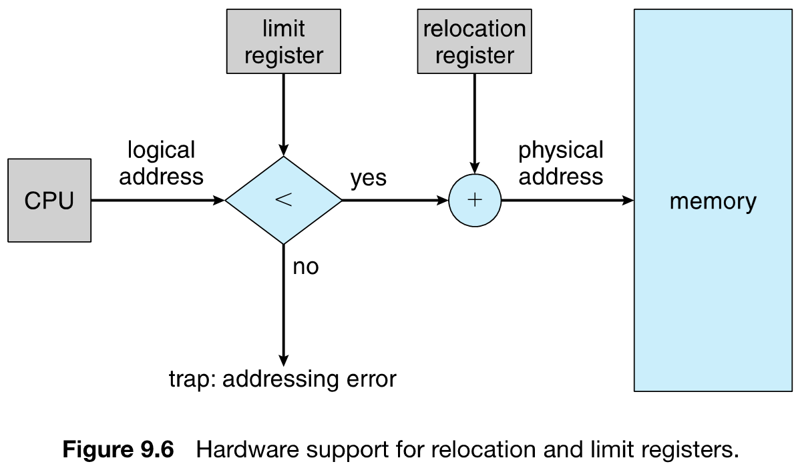

+ multiple-partition allocation：将进程作为一个整体进行分配，分配一整块内存。进程内存有限制，使用超出会出错。由于进程的运行时间不同步，程序运行时会产生大量的 holes，操作系统需要存储每个进程的 relocation register 和 limit，同时维护一个 holes 组成的链表。

  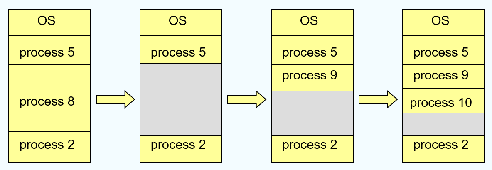

  + 寻找 holes 有多种方法：First-fit (第一个 hole)，Best-fit (最小的 hole)，Worst-fit (最大的问题)。

**Fragmentation**

+ External Fragmentation：外部碎片问题，由于系统的动态加载，导致很多不连续的 holes。
+ Internal Fragmentation：内部碎片问题，由于进程实际分配的内存与进程需要的内存大小不一致，存在进程不会使用的内存空间。

为解决外部碎片问题，可通过 compaction (紧致)，进行进程的拷贝与搬运，制造大块的连续空间。但这种方式会导致较大的开销。

### Paging

非连续分配。

将虚地址空间分解为 pages，将物理地址空间分解为 frames。给进程分配内存时，以一个 frame (physical page) 为单位进行分配。一个 page 对应一个 frame。

不存在外部碎片，但依然有内部碎片问题。

查找机制如下：

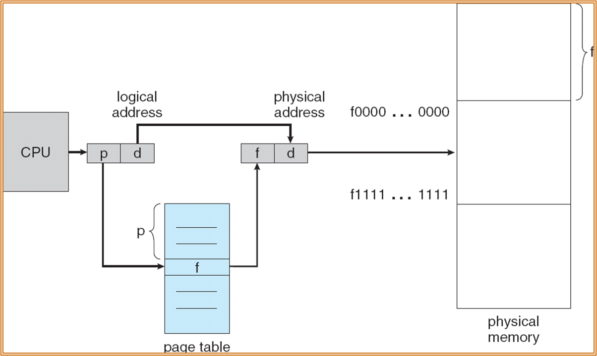

找到第 f 个 frame 中偏移了 d bytes 的内容。Page table 也是放在内存中。RISC-V 中使用 satp 寄存器指向了 page table 起始的物理地址，进行内容的查询。

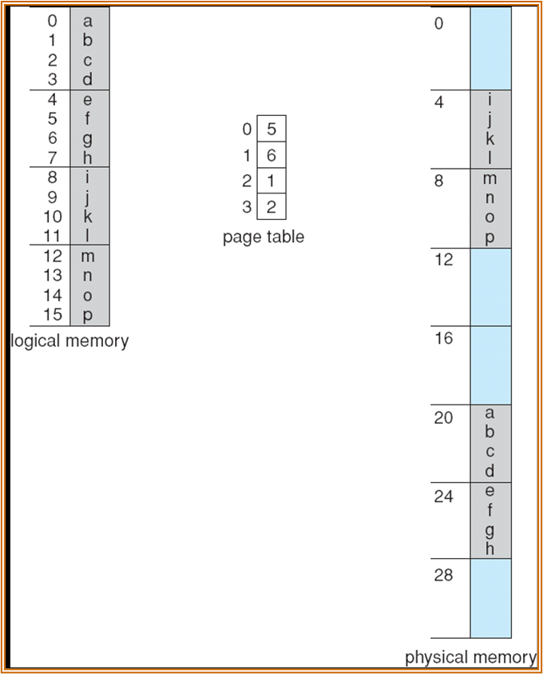

使用 paging 管理时，page 可能不连续。

使用 free-frame list 用以管理空闲的 frame。(下图左侧为分配前，右图为分配后)。

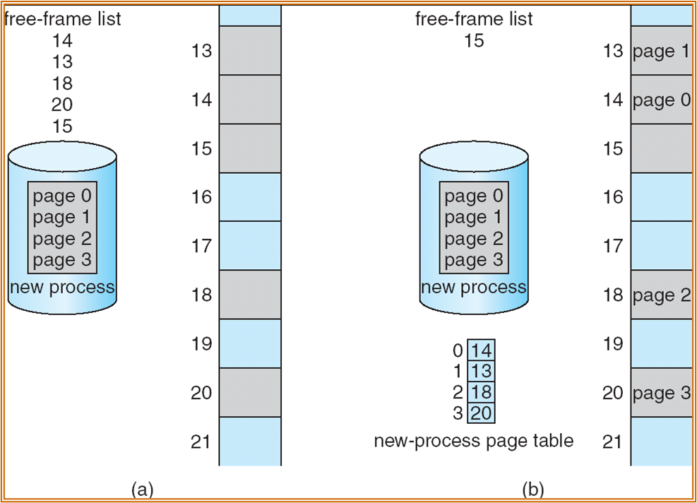

实现 paging 需要 MMU 的支持，使用一组寄存器存储信息：

**Page-table base register (PTBR)**：指向 page table 的起始位置 (物理地址)。

**Page-table length register (PTLR)**：用以表示 page table 的大小 (常数)。

找到特定的 page 需要两次主存的访问，可以使用 TLB 进行加速。

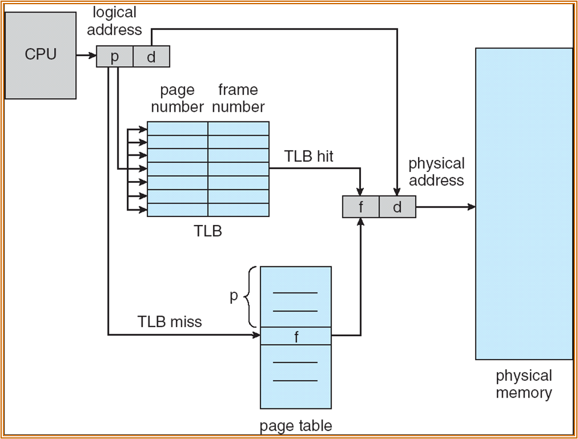

TLB (translation look-aside buffer，旁路缓存 / 快表) 中存放了 page number 以及对应的 frame number。

若有多个进程，存在使用同一 VPN 进行取 Page 的情况，此时需要在 TLB 中存放 **address-space identifiers** (ASIDs)，用以区分不同的进程的内存空间。

page table 中所有的 frame 可能尚未分配，故需要设置 valid-invalid bit。

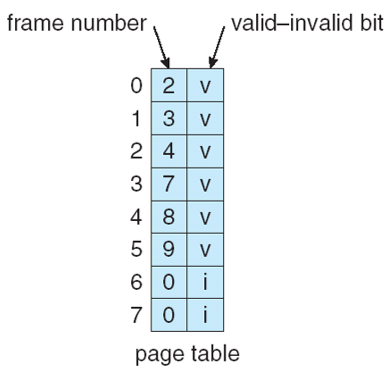

若访问了 invalid 的 page，则称为 page fault。

**Effective Access Time**

访问一次 TLB 的时间代价为 $\epsilon$。访问内存为一个时间单位。

假设 TLB 命中的概率为 $\alpha$，可以得到 $Effective\,Access\,Time\,(EAT) = (1 + \epsilon)\alpha+(2+\epsilon)(1-\alpha) = 2 + \epsilon - \alpha$。

**Shared Pages**

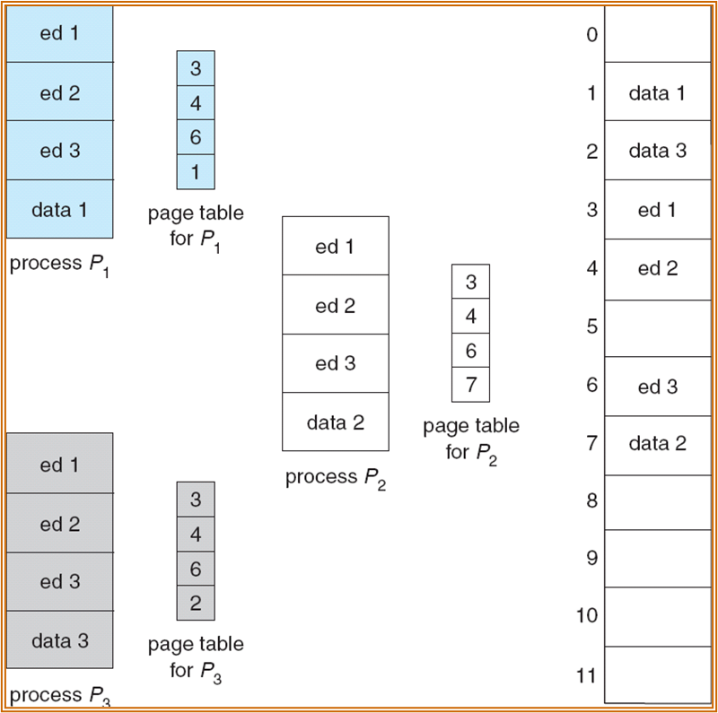

如上图中，三个进程都使用了同样的 ed 段，可以赋相同的 frame 值。

#### 页表结构

**Hierarchical Paging 多级页表**

若 page 过多，需要对 page table 本身也进行分页。

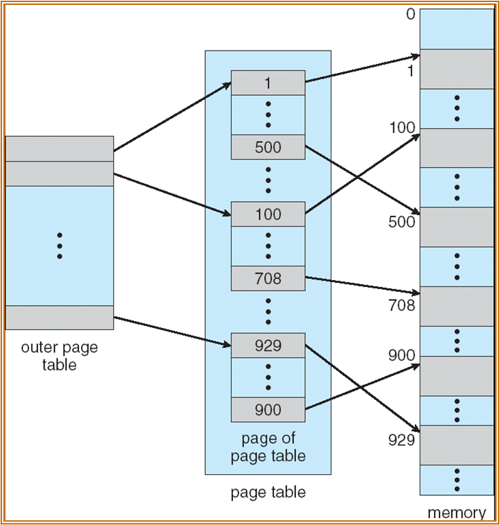

上图中为某 2 级页表的示例。

第一层使用 p1 进程查询，第二层使用 p2 进行查询。

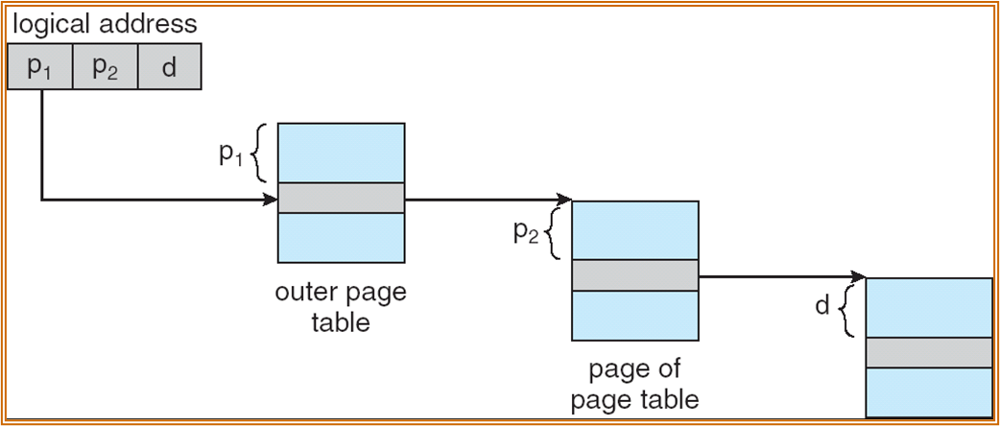

在次情况下，PTBR 寄存器指向 outer page table 的起始位置的物理地址。

**Hashed Page Table 哈希页表**

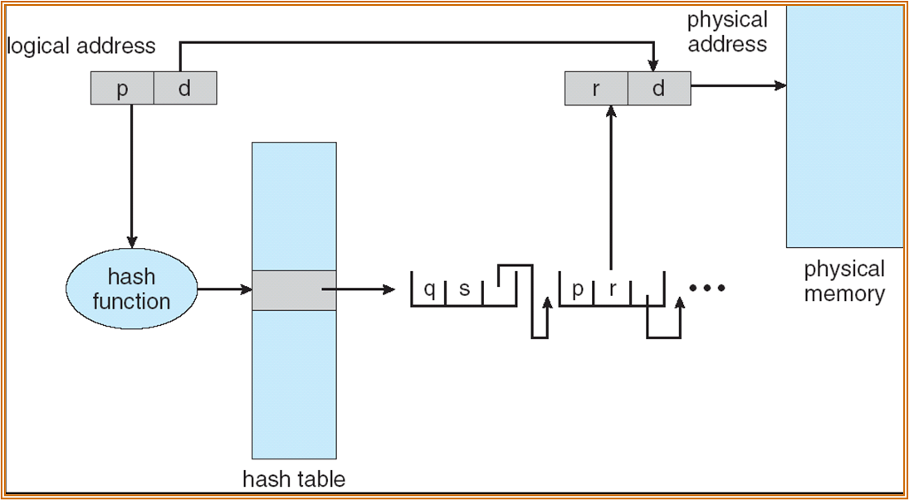

每个进程维护一个 hash table，hash table 中的每个 entry 都会指向 page table entry。

若发生 hash collision，将各个 PTE 使用链表相连。

多级页表和哈希页表均可以通过 TLB 进行加速。

**Inverted Page Table**

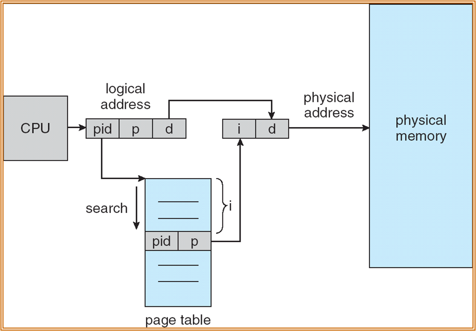

整个 OS 中只有一个 page table，但该 page table 是物理地址空间的一个映像，例如第 0 行对应第一个 page frame。页表中存储的是 ASIDs 和 page number。地址查找为一个查找的过程。

同样可以使用 TLB 进行加速。有时会将 page table 存储在 Content-addressible Memory (CAM) 中进一步加速查找。

### Swapping

将部分进程进行 swap out 到磁盘中，以保证足够的内存进行运行。

使用分页管理后，swap-in & swap-out (整个进程替换)，可以变为 page-in & page-out (仅替换部分的 page)。

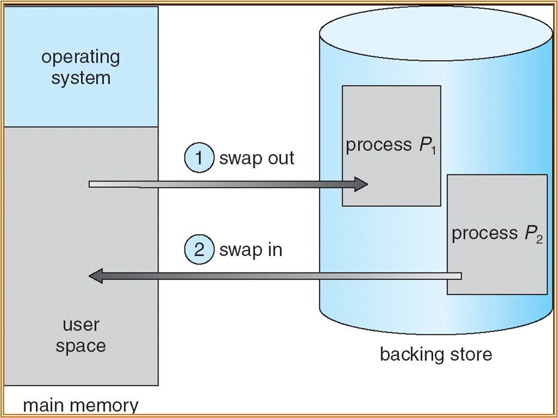

### Segmentation 段

将 page 进行进一步地划分，与程序中的函数段较为吻合。

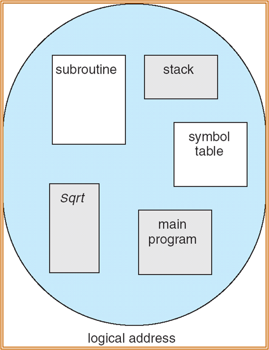

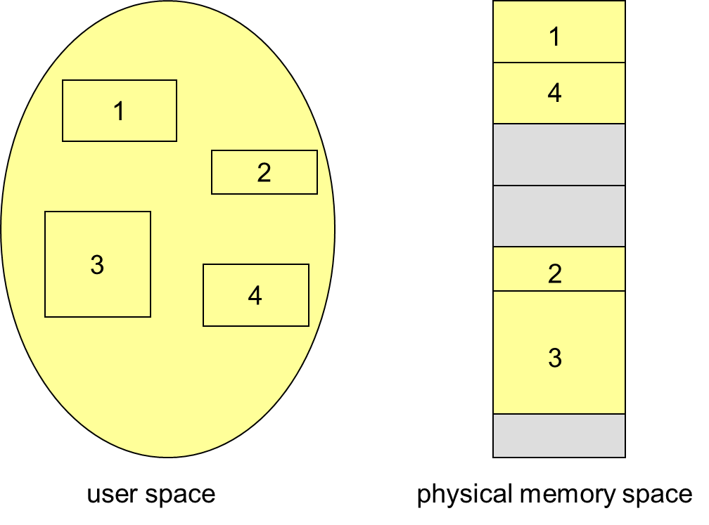

与 page 类似，也有 segment-number 和 offset。

也存在 Segment table，使用 base 和 limit register 进行确定。

也存在 **Segment-table base register (STBR)** 和 **Segment-table length register (STLR)**。

此处 STLR 的长度并不确定，若 segment-number 大于 STLR 则发生了段错误。

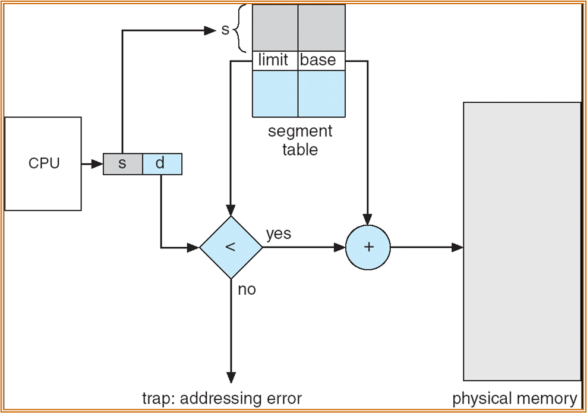

由于 segment size 不确定，segment 的存储不一定需要对齐。

segment 也需要 protection bits。例如 valid-invalid bits，用于表示 segment 是否 legal。此外还有一些表示权限 (读写等) 的位。

## 虚拟内存

> 2023 / 11 / 23

### Demand Paging

请求式调页。

当且仅当需要访问某一 page 时，才会将 page 加载进主存。

当某一 PTE 的 valid 位为 0 时，出现 page fault，需要区分两种情况：一是非法访问 (将中断程序，使用 PCB 中其他的辅助信息进行判断)，二是 page 不在主存中。

使用 lazy swapper 进行页交换 (只有访问时才会进行页交换)。

#### Page fault

处理流程如下：

1. 区分非法访问和 page 不在主存中。
2. 获取一个 empty frame。
3. 将该 frame swap into 主存。
4. 对页表进行重置。
5. 将 valid 位置 v。
6. 重新运行之前发生了 page fault 的指令。

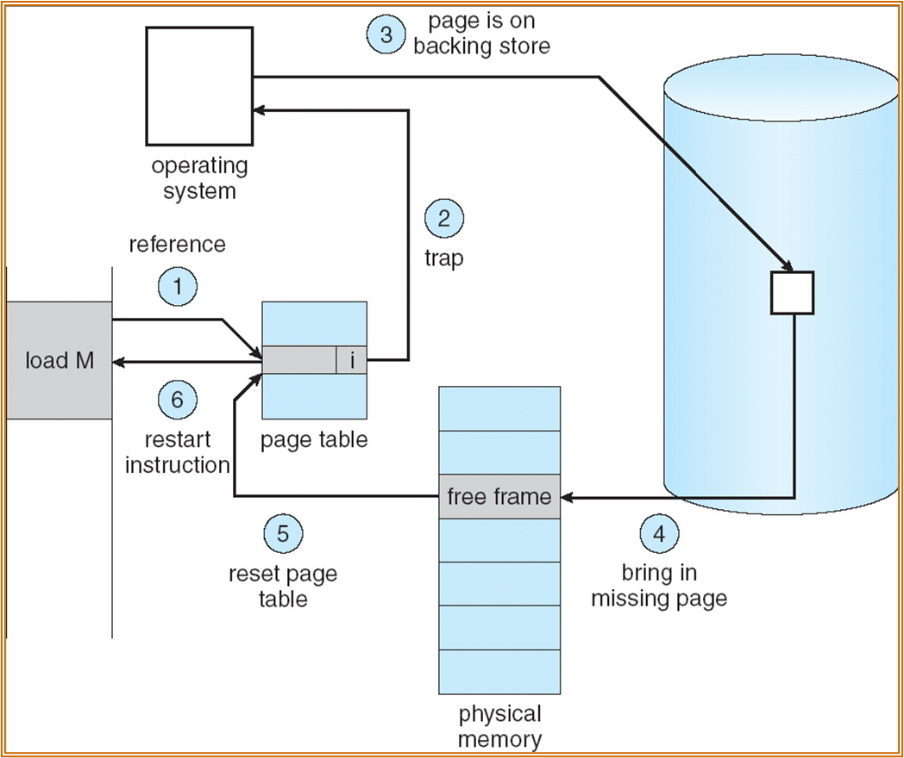

一个特殊情况：

+ 若某一条指令需要进行 block move，且数据跨页。若产生 page fault，则会发生一些数据成功转移，而部分数据未能转移的情况。会产生数据错误。

**Demand Paging 的 EAT**：p 为发生 page fault 的概率。

$$(1-p)*memory\,access+ \\ p*(page\,fault\,overhead+swap\,page\,out+swap\,page\,in+restart\,overhead)$$

上述公式的后半部分由于指令重启，后半部分不包括 memory access。

#### 用途：Process Creation & COW

使用 virtual memory 来优化进程创建。

**copy-on-write**

| 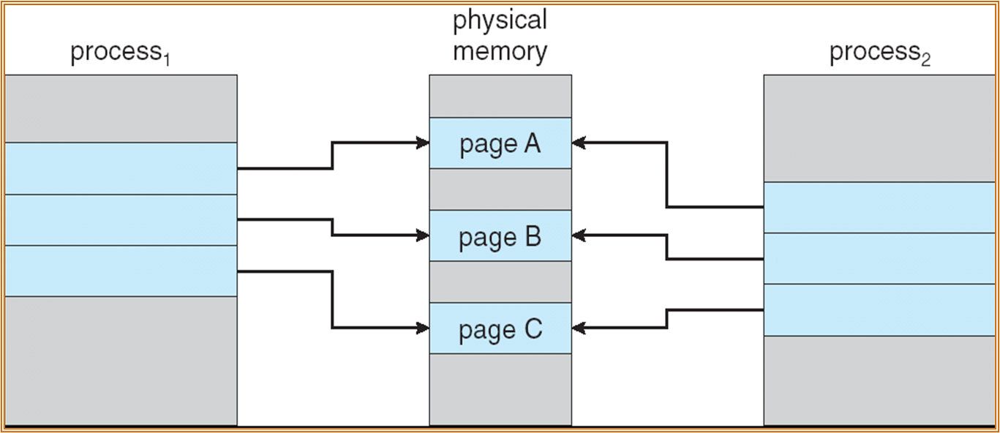 | 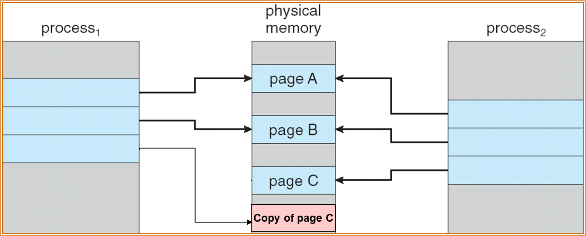 |
| ------------------------------------------------------------ | ------------------------------------------------------------ |

P1 和 P2 均使用 Page A、Page B、Page C，三个页均为只读 (为防止共享产生的错误)。若 P1 尝试修改 Page C，会引起 page fault，此时会复制 Page C (复制得到的页可写)，将 P1 的 PTE 指向 copy。

所以，只有在写时才会产生 page 的复制，多个进程在不少情况下可以共享 page，可以节约内存的使用。

!!!note
	brk 用于控制 heap 的大小。 
	在使用 malloc 分配时，实际上 OS 并不会立刻分配 Page， 
	只会将 sbrk 进行调整，增加堆的大小， 
	访问这片 memory 后才会分配 Page。

#### 用途：Zero fill on demand

Block start by symbol，未被初始化或初始化为 0 的全局变量或静态变量。

程序加载到内存时，text 和 data 区域会存放了已经初始化的全局或静态变量。

此策略可以节约内存。实际上建立新的、未初始化的全局或静态变量时，只需要映射到物理地址上一个全 0 的地址即可。

初始化时，进行 copy-on-write 操作。

#### 用途：Memory mapped file

`mmap(va, len, prot, flags, fd, offset)`

prot 用于保护 (只读等)，fd 为文件描述符，加上 offset 后，将长度为 len 的内容加到 va。

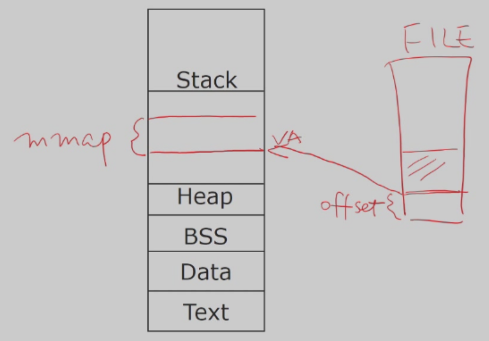

将文件加载到内存中，使用 load 或 store 进行修改，提高效率。

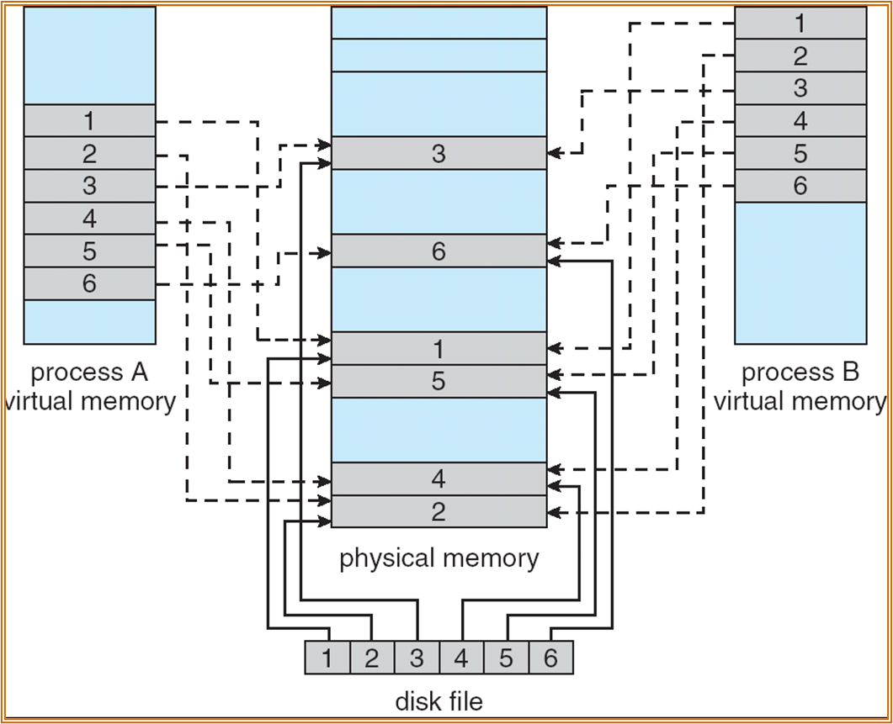

#### Page Replacement

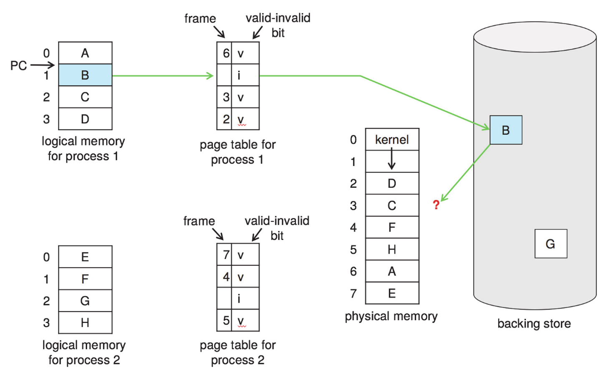

需要设置 modified bit 用于确认是否要将页写回 memory。

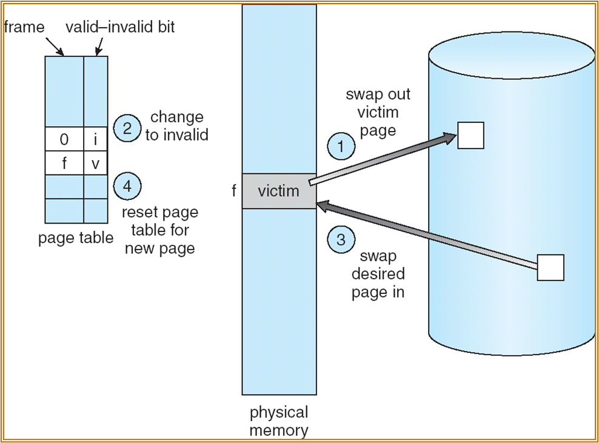

**替换算法**

需要尽量降低 page-fault 的概率。

`FIFO`：First-In-First-Out Algorithm

+ 特定情况下，更多的 frame 不一定能够减少 page fault：
+ 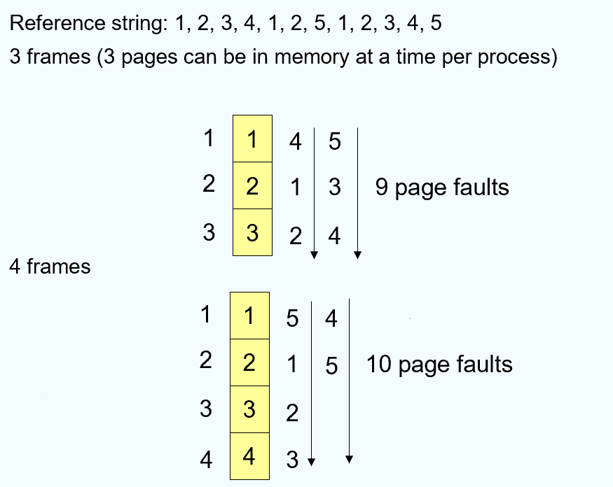

另一个举例：

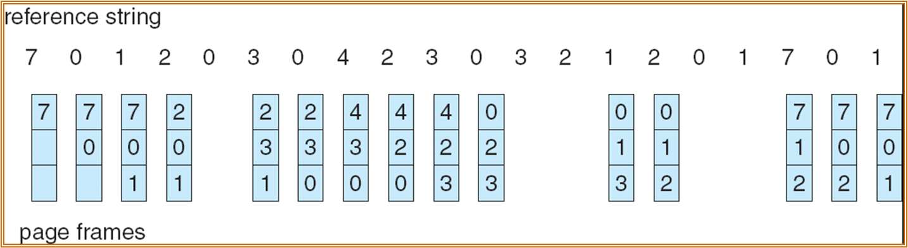

`Optimal`：Optimal Algorithm，替换未来最长时间不会被用到的 Page。

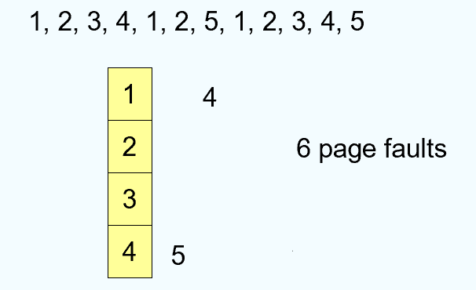

+ 若无法得知未来的使用情况，则退化为 FIFO。
+ 在真实的操作系统中不能实现，主要用于参考。

`LRU`：Least Recently Used Algorithm

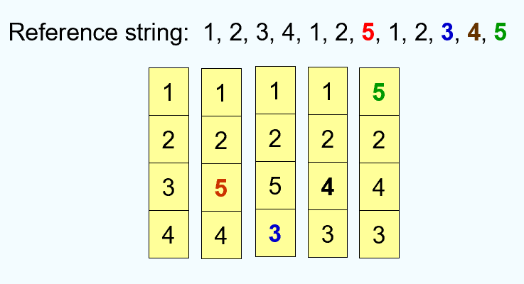

+ LRU 算法的实现需要硬件的支持。给每个 Page 设置一个计数器。替换时间戳最久的 Page。
+ 也可以使用栈来记录最近被使用的 Page。
+ 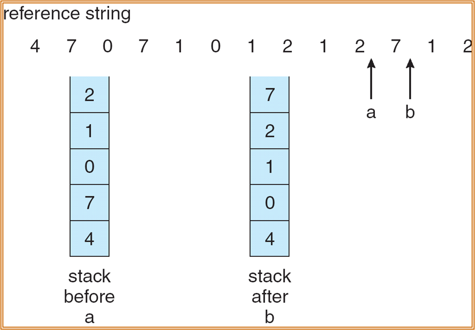
+ 将最近被访问的页放到栈顶。

`LRU APPROX`：LRU 近似算法

+ LRU 中的计数器法代价较大，可以使用 reference bit (相当于长度为 1 的计数器)，但会出现选择的问题。

`Second-Chance`

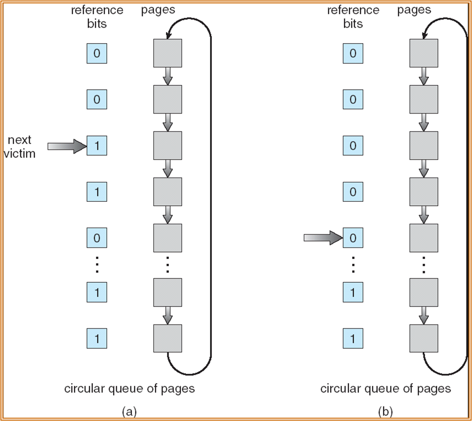

+ 一方面进行正常访问，一方面对加载进内存的 Page 进行循环访问。循环扫描时，若遇见一个 reference bit 为 1 的 Page，说明 Page 在一个循环周期内有过使用，置成 1。若遇见 reference bit 为 0 的 Page，则直接取为将被替换的 Page。

`Counting-based`

增加一些多的 bit 用于计数 (长度小于时间戳)。在 Second chance 的基础上，将 reference bit 移位到 counter 中。实际上保存了 t 个循环周期内的访问历史。

+ **LFU**：least frequent used，counter 最小的 Page 替换。
+ **MFU**：most frequent used，counter 最大的 Page 替换。

#### Frame Allocation

主要有两种分配的策略：Fixed Allocation、Priority Allocation。

+ Fixed Allocation：按进程大小比例进行分配、完全公平分配等。

替换时，页分为 Global、local allocation，即替换时一个进程是否可以选择替换其余进程的 Page。

### Working Set Model

#### Trashing 颠簸

低 CPU 使用率、ready Queue 中无进程、进程均在硬盘的等待队列中、硬盘使用率高……在有 long-term schedule 的系统中，为提高 CPU 的利用率，scheduler 会加载更多的进程。

以上现象由物理内存过小需要不断与硬盘进行 Swapping，出现颠簸。

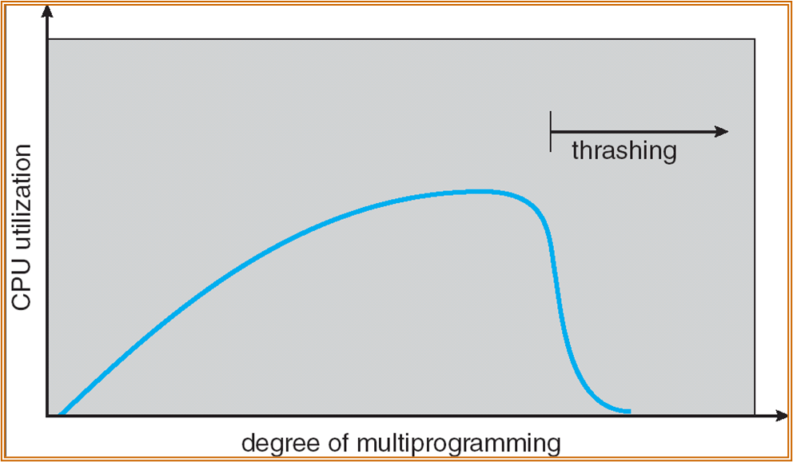

!!!note
	由于局部性存在，demand paging 有效 
	但当 $\sum Locality\_Size > Memory\_Size$ 时会出现 thrashing。

#### Working Set 工作集

每个进程在一段时间中访问的 Page 的个数。

$\Delta\equiv working\mbox{-}set\,\,window\equiv fixed\,\,number\,\,of\,\,Page\,\,references$

WSS~i~ - working set size of Process P~i~ 

$WSS_i= total\,\,number\,\,of\,\,pages\,\,referenced\,\,in\,\,the\,\,most\,\,recent\,\,\Delta\,(varies\,\,in\,\,time)$

D = $\sum$ WSS~i~ $\equiv$ total demand frames for all processes in the system。

若 D > M，则延迟某一进程。

实际应用中 Working Set 会比 $\Delta$ 小，反应了接下来可能频繁访问的页面。每个进程都有一个 Working Set 落在 Working Set 中的 Page 会保留，不在的会换出。

### Allocating Kernel Memory

一般希望获得连续的内存空间。从 free-list 中获得。

#### Buddy System Allocator

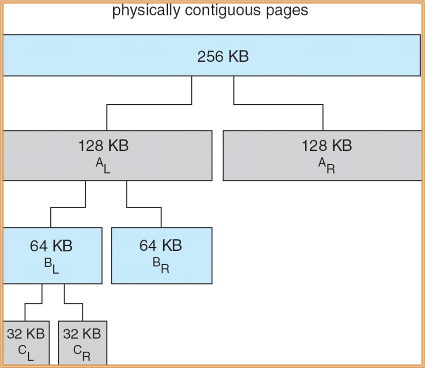

使用“二分”的方式进行分配。若内存单元过小，则进行合并；若过大，则进行减半。

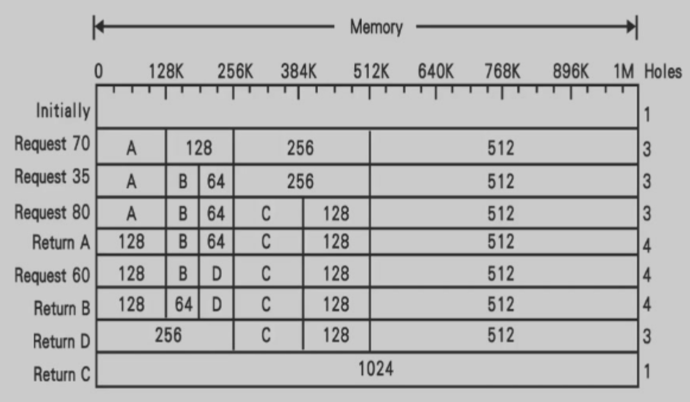

此外也可以使用 freelist + bitmap 的方式进行实现。

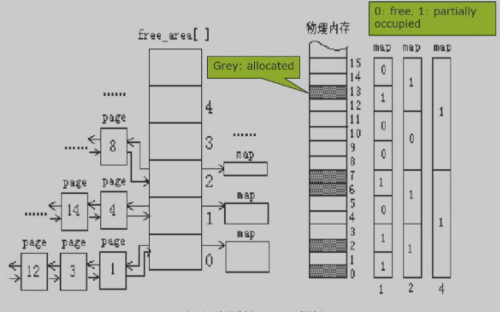

左侧的 free area 中，不同的节点连接了一系列 Page 数量相同的单元，不同节点所连的 Page 数量不同。每个节点对应了一个 bitmap，不同的节点的 map 的密度不同 (如第 1 个 map 两个 page 设 1 bit)，表示这一区域中是否有被使用的 Page。

上图中，Page 8 在节点 2 上，表示从 8 开始的 4 个 Page 均为 free。

#### Slab Allocator

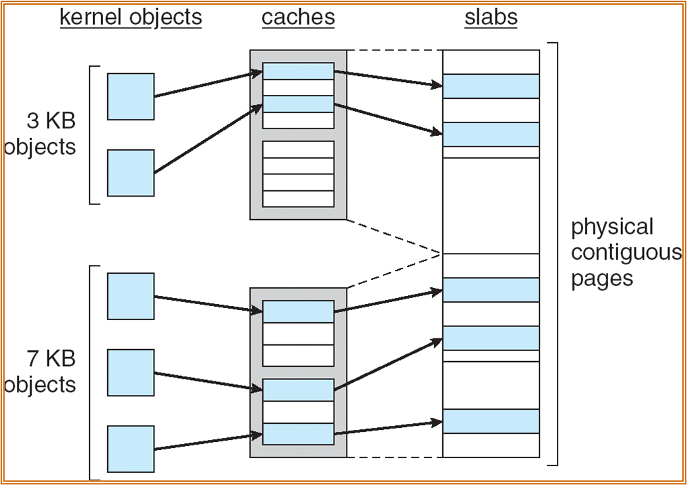

## 文件系统实现

> 2023 / 12 / 07

###  File-System Structure

文件系统通常存储在外存之上。

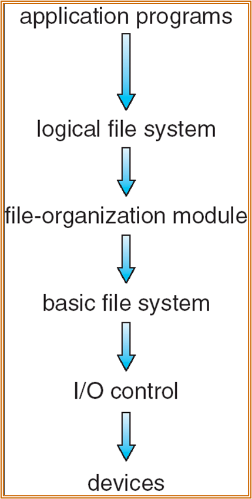

+ Device：HDD, SSD, NVM 等等。
+ I/O control：硬件层面的指令实现 block 的读写。
+ Basic file system：完成读写块的操作，包含读写的调度。
+ File-organization module：将 Logic block 映射到 Physical block 上，管理空闲块。
+ Logical file system：管理文件的 metedata，文件的保护和安全功能实现。

#### FS Implement Data Structure

+ Disk 结构：**Boot control** block、**Volume control** block (superblock in Unix)、**Directory structure per file system**、**Per-file FCB** (inode in Unix)。
  + **FCB** - File Control Block，大小不到一个 block，一个 block 中可存储多个。
    + 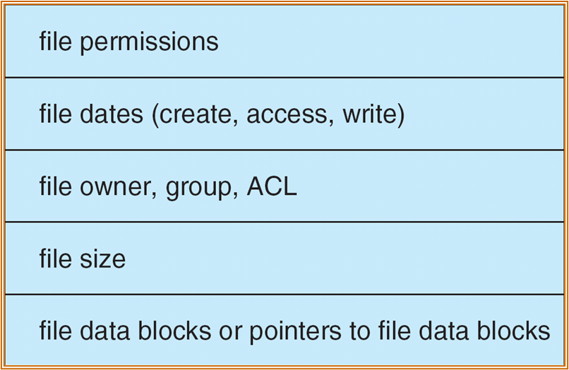
    + FCB 中不包含文件名，因为 FCB 面向操作系统。文件名存储在目录系统中。
+ In-memory 结构：In-memory **mount table** about each mounted volume、**Directory cache** (缓存最近访问的目录) 、**System-wide open-file table**、**Per-process open-file table**。
  + 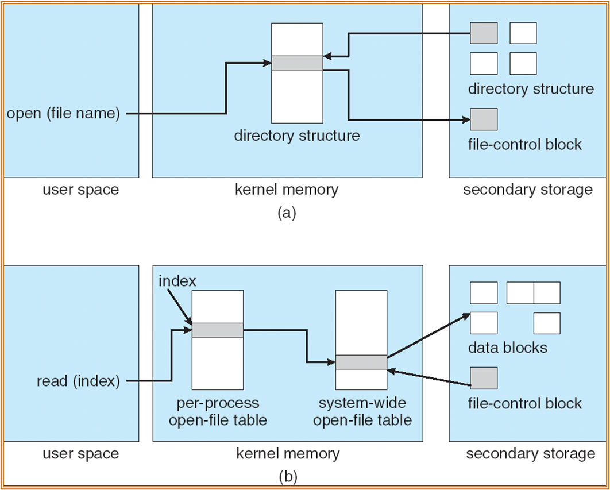
  + Index 为文件描述符。Per-Process open-file table 中的第一项为 std read，第二项为 std write。

#### Virtual File System

实现跨设备的文件管理。利用分层设计实现，相当于对不同的设备进行封装，提供统一的 API 接口。

+ 属于 Logical file system Layer。位于内存中，不是物理的文件系统。

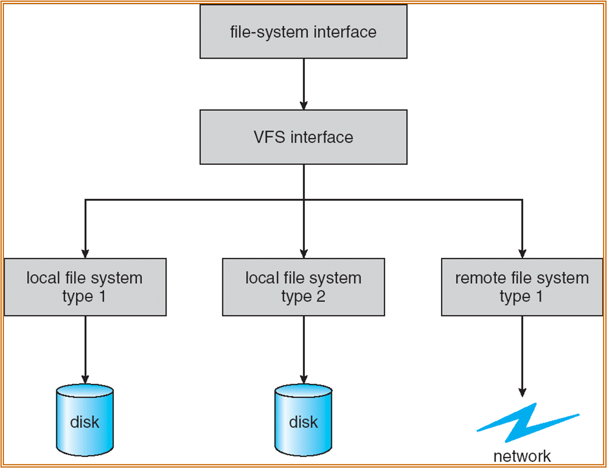

### Diectory Implement

需要在目录中实现文件的各类操作功能。

+ 可以利用 Linear List 实现，但不利于检索。
+ 可以利用 Hash Table 实现。需要解决 Hash Collisions 问题。

