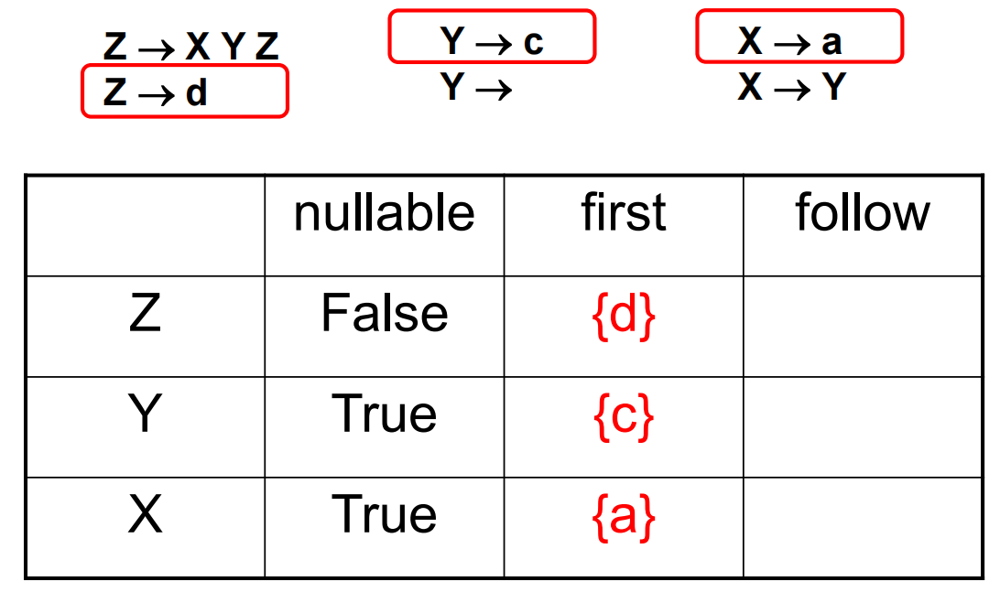

## 编译原理

> 2023 - 2024 春夏

### Introduction

> 2024.2.29

`compiler`: 一个将一种语言翻译为另一种语言的程序 (语言与计算机相关)。

#### Typical Workflow of a Compiler

编译器的工作阶段通常如下：分为**前、中、后**三端

+ **词法分析** (Lexical Analysis): String $\rightarrow$ token sequence (记号序列)，删除不必要的部分。通常使用正则表达式定义 (例如 `rm 2024*`)，用于匹配不同的 token。

+ **语法分析** (Syntactic Analysis): 将记号序列解析为某种语法结构 (如语法树)。

+ **语义分析** (Semantic Analysis): 分析语法树节点的属性信息等。得到符号表等。

  

+ **中间代码生成** (IR): 源语言与目标语言的桥梁。(三地址: 每个表达式中至多一个操作符两个操作数)

  
  
+ **基于中间表示的优化 ** (机器无关代码优化): 对中间代码进行优化和变换，降低执行时间，减少资源消耗。

  

+ **后端 - 目标代码生成**: 把中间代码翻译为目标语言，涉及到**指令选择**、**寄存器分配**、**指令调度**等。

  

#### Tiger 编译器

+ **AST** (抽象语法树): 经过语法分析 + "Parsing Actions" 生成。
+ **IR Tree** (树型中间表示): 语义分析之后按照一定规则生成。进行了归一化 (Canonicalized) 的操作。
+ **Control Flow Analysis** (控制流分析): 判断分支语句的执行路径 (可以去除不可达的路径)。
  + **CFG** (Control Flow Graph) (控制流图): 方便进行数据流分析–如活跃变量分析 (Liveness Analysis)。
+ **Interference Graph** (冲突图): 从活跃变量分析的结果构造，用于指导寄存器分配。

### Lexical Analysis 词法分析

> 2024.03.07

#### Lexical Token

`定义`：一个字母序列，文法中的基本单元。

常见的 **token** 有：

*多数语言中保留词不作为 identifiers。*

常见的 **non-token** 有：

词法分析的示例如下：

#### Regular Expression

*使用**正则表达式**来描述 token 规则，再使用 **DFA** 实现上述的正则表达式。*

*词法分析阶段不用关心 string 的含义，只需要关心字符串是否在语言中。*

!!!note
	其中 a | $\epsilon$ 与 a | 等价。

!!!note
	**更多的简写：** 
	 
	简写不会让正则表达式的表达能力增加。 

!!!note
	 
	第五行表示的是**注释**或**空格、换行**等。 
	!!!warning
		上述的例子中存在歧义，例如 `if8` 可以解释为 ID 也可以解释为 if + 8。 
		现代的编译器会引入最长匹配机制且按照规则的优先级逐条匹配 (if8 解释为 ID)。

#### Finite Automata

`确定性状态机`：**no two edges leaving from the same state** are labeled with the same symbol. 

将上述的六个 DFA 拼接成一个 DFA：

计算机中 DFA 的实际上通过表格的方式 (**transition matrix**) 实现的。

+ 每一行表示一个状态，每一列表示读入的 symbol，存储的值表示读入后跳转到的状态。
+ 0 表示错误状态。

额外需要一个矩阵存储每一个状态是否为终态 (**"finality" array**)，以及其对应的输出标签是什么。

+ 为实现 Longest matching，每次遇到可以终止的节点时，先记录当前的分析结果，继续向后扫描，直到无法扫描为止。
  + 需要 `Last-Final`，`Input-Position-at-Last-Final` 两个变量进行记录。
  + 
  + 

#### Nondeterministic Finite Automata

**Thompson's Construction**

> 将正则表达式转化为 NFA

|                         Regular Exp                          |                             NFA                              |
| :----------------------------------------------------------: | :----------------------------------------------------------: |
|  |  |

**Subset Construction**

> 将 NFA 转化为 DFA

+ **edge(s, c)**：1.the set of all NFA states reachable by following a single edge with label *c* from state *s*.
+ **closure(S)**：the set of states that can be reached from a state in *S* without consuming any of the input, that is, by going only through ∊-edges. 

算法思想：

算法实现：

算法例子：

|                             NFA                              |                             DFA                              |
| :----------------------------------------------------------: | :----------------------------------------------------------: |
|  |  |

上述右图的部分等价状态可以合并，以缩小 DFA。但有部分的等价状态无法消除。

上述的算法总体思想为找到非等价的状态，举例如下：

#### Lex: A Lexical Analyzer Generator

Lex 是一个程序，

+ 输入：a text file containing regular expressions, together with the actions to be taken when each expression is matched.
  + 
+ 输出：Contains C source code defining a procedure *yylex* that is *a* table-driven implementation of a DFA corresponding to the regular expressions of the input file, and that operates like a *getToken* procedure.

### Syntax analysis 语法分析

#### CFG 上下文无关文法

正则表达式的无法表达括号匹配等 Recursive Structure 规则。

CFG 在进行替换时不需要关心 non-terminal symbol 的左右 (上下文) 如何，根据规则进行替换即可。

一个不含分支语句的程序的 CFG 可以表达如下：

其中 S 表示语句，可以使用分号顺序连接。E 为数字或变量。

在判断程序是否正确时，主要思路为判断程序是否有语法错误。

上述推导遵循了最左推导 left-most derivation，可以根据次生成 parsing tree。某些情况下最左和最右推导等价 (当文法没有歧义时)。

一颗 parsing tree 可能对应多个推导关系。

**歧义**

需要对生成的规则进行更改以消除歧义。规定乘法优先级高于加法，并统一进行左结合。

为识别是否已经读到文件的末尾，引入 \$ (EOF)。在规则中加入 $S\rightarrow E \$ $。

#### Top-Down Parsing

**Recursive Descent Parsing**: parses **LL(1)** grammars ： **L**eft-to-right parse; **L**eftmost-derivation; **1**symbol lookahead.

根据读取到的 token，从左到右读取，尝试寻找规则进行匹配进行 parsing tree 的构建。

~~~c++
enum token {IF, THEN, ELSE, BEGIN, END, PRINT, SEMI, NUM, EQ};
extern enum token getToken(void);
enum token tok; 
void advance() {tok=getToken();} 
void eat(enum token t) {if (tok==t) advance(); else error();}
void S(void) {
    switch(tok) { 
    case IF: eat(IF); E(); eat(THEN); S(); eat(ELSE); S(); break; 
    case BEGIN: eat(BEGIN); S(); L(); break; 
    case PRINT: eat(PRINT); E(); break; 
    default: error(); }}
void L(void) {
    switch(tok) {
    case END: eat(END); break;
    case SEMI: eat(SEMI); S(); L(); break;
    default: error(); }}
void E(void) { eat(NUM); eat(EQ); eat(NUM); }
~~~

上述的实现主要依靠替换后的第一个 symbol 进行规则的选择，但并不适用与所有的语法。

**Predictive Parsing**

对于无法通过第一个 symbol 进行判断 (例如都是 non-terminal)，基于一定的规则进行计算首先派生出的 terminal symbol，再进行判断。

对于例如 $Z\rightarrow XY$ 的规则，首先需要考虑的是 X 在派生之后会产生的第一个 terminal 符号 (First)。但需要考虑到 X 可能派生出空串 $\varepsilon$ (Nullable)，所以需要考虑 Y 可能派生出的第一个 terminal。但 Y 若也可能派生出 $\varepsilon$, 则需要考虑紧跟在 Y 之后的 terminal (Follow)。

$\gamma\rightarrow^* t\beta$，其中 t 为 terminal symbol。$\gamma$ 和 $\beta$ 表示任意的字符串，$t\in First(\gamma)$。

$X \rightarrow^* \alpha Xt \beta$，$\alpha$ 和 $\beta$ 表示任意的字符串，$t\in Follow(X)$。

计算 Nullable 算法：

~~~c
for each symbol X:
	Nullable(X) = False
repeat
	for each production X -> Y1 Y2 … Yk:
		if Nullable(Yi) = True for all 1 <= i <= k:
			Nullable(X) = True
until Nullable did not change in this iteration
~~~

需要注意的是，每一轮都需要遍历所有的规则，每一轮循环结束都需要和前一次的结果进行比较，直到没有变化后结束循环。

First 和 Follow 的算法如下：

举例如下：

|                           First-1                            |                           First-2                            |                           First-3                            |                           First-4                            |
| :----------------------------------------------------------: | :----------------------------------------------------------: | :----------------------------------------------------------: | :----------------------------------------------------------: |
|  |  |  |  |

|                           Follow-1                           |                           Follow-2                           |                           Follow-3                           |
| :----------------------------------------------------------: | :----------------------------------------------------------: | :----------------------------------------------------------: |
|  |  |  |

需要额外注意的是 $X\rightarrow Y$ 规则会使 Follow(Y) 和 Follow(X) 出现重合。最终可以得到如下表格：

需要将上述的表格转化为一下的表格，以指明使用那条规则进行 parsing tree 的构建：

构建的算法如下：

+ if T $\in$ First($\gamma$) then enter $X\rightarrow \gamma$ in row X, col T.
+ if $\gamma$ is Nullable and T $\in$ Follow(X) then enter $X\rightarrow \gamma$ in row X, col T.

上述的表格指的是，在自顶向下派生 non-terminal 时，读到词法分析得到的序列中的某个 symbol 时需要选择的规则。若是查表得到了空格，则表示出现了语法错误。

还需要注意上述的表格还存在多条规则一个空格的情况，这可能由两种情况导致：

+ Left-Recursive：$A\rightarrow A\alpha,\,A\rightarrow\beta$.
  + 修改后：$A\rightarrow\beta A',\,A'\rightarrow\alpha A', A'\rightarrow \varepsilon$.
+ Left-Left Factoring：修改如下：
  + 

举例如下：

**错误恢复**

一般来说，在遇到错误后，需要从错误中恢复过来继续进行语法分析，以分析得到更多的潜在的语法错误。

常见的做法如下：

~~~c++
int Tprime_follow[] = {PLUS, RPAREN, EOF}; 
void Tprime() { 
	switch (tok) { 
		case PLUS: break; 
		case TIMES: eat(TIMES); F(); Tprime(); break; 
		case RPAREN: break; 
		case EOF: break; 
		default: print("expected +, *, right-paren, or end-of-file"); 
 		skipto(Tprime_follow); 
 	}
}
~~~

**LL(k)**

k 表示在选择派生规则时需要根据几个 input 才能判定。LL(1) 就表示一个 1 个 token 就能无歧义的进行规则选择。

==every LL(k) grammar is an LL(k+n) grammar, for any n.==

所以在例如在证明一个 grammar 是 LL(3) 时，可以先尝试证明其为 LL(1).
