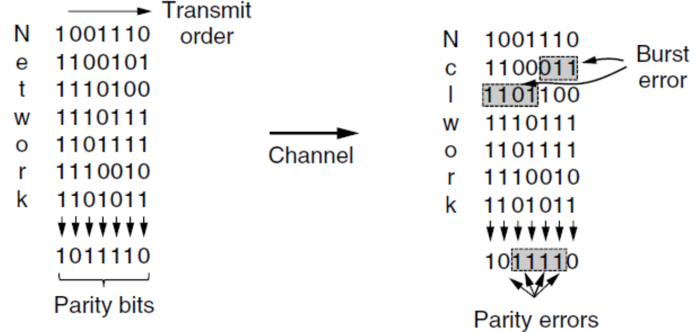
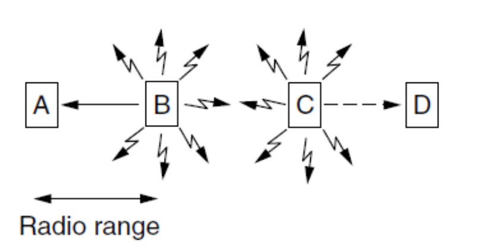

# 计算机网络

## Introduction

> 2023 / 09 / 19

### Network Hardware

#### 按照传输技术分

**Broadcast links** 多播 multicasting

+ 所有机器都需要借助有线 / **无线**链路。广播的 ip / Mac 地址为全 1。初始的，未经分配的地址 (初始化地址) 为全 0。

+ Wifi 是一个典型的广播链路。

**Point-to-point links** 单播 unicasting

+ 两点之间的可选的路径很多，需要借助算法选择。

#### 按照规模分

分类的标准为距离。

#### Communication Links

不同种类的线传输速率不同。(无线也是一种传输介质)

==Different links can transmit data at different rates, with the transmission rate of a link measured in *bits/second*==

~~~
路线一	速率: 1K bits/s => 1 bit duration 1/1000 = 1 ms
路线二	速率: 100 bits/s => 1 bit duration 1/100 = 10 ms
如果有一个持续 10 ms 的 noise (修改对应的 bit)
路线一最多会被影响 11 bits，路线二最多被影响 2 bits
~~~

#### PAN

Personal Area Network，个人设备之间组成的网络。

由于 2.4 Ghz 左右为 ISM 频段，常用于个人设备之间的无线连接 (Wifi)。(带宽高于 蓝牙)

#### LAN

Local Area Network，局域网。

有线无线都有 dynamic / static 的设计。static 静态分配，dynamic 动态分配。

**static**：有 TDM (时间分配)，FDM (空间分配) 等。

**dynamic**：按需分配。有中心化 (centralized)，去中心化 (decentralized) 两种。

#### 其他网络

Metropolitan Area Network，城际网。

Wide Area Network，广域网。有两种实现，VPN 和 ISP。

+ VPN，Virtual Private Network。直接在现有网络上架设。
+ ISP，Internet Service Provider。申请线路连接。

==The cellular telephone network is an example of a WAN that uses wireless technology==

### 网络举例

由 hierarchy 到 distribute，增加了冗余，增强了鲁棒性。

#### 移动网络

UE 用户设备。eNodeB 基站。S-GW，P-GW 网关，通向不同的网络 (如，通信网络、互联网)。

E-UTRAN (Evolved UMTS Terrestrial Radio Access Network)，连接用户与基站。

EPC (Evolved Packet Core)，核心网络。HSS (Home Subscriber Server)，通信卡管理。

#### Frequency Reuse

为防止相互之间频段干扰，将覆盖区域分为一个个小六边形区域。相隔较远的两个六边形可以复用相同的频段。

#### Switching

+ Packet Switching。无需连接，只需包传输。如互联网。
+ Circuit Switching。需要连接。如打电话。

#### WLAN

使用 **ISM** 频段，组成局域网。

+ multipath fading。无线传输中，无线电波通过多条路线达到设备，生成了波的相消或增强。
+ 为克服上述问题，可以使用不同的频率传输相同的数据。可以进行重复的传输。跟踪天线到天线之间的路径传输 (MIMO)。

**ALOHA** 算法使用随机的间隔避免传输的冲突。(降低冲突的概率)

### 网络协议

Network Protocols

#### 设计目标

可靠 Reliability。需要能够处理部分节点宕机、产生错误的情况。

资源分配 Resource allocation。“随来随用”。

进化 Evolvability。使用分层结构，封装网络内部的信息，使得最新的技术可以不断得到应用。

安全 Security。

#### 协议层级

**Network architecture**: a set of layers and protocols

**Protocol stack**: a list of the protocols used by a certain system, one protocol per layer。

协议定义了传输的格式，顺序，接受信号之后的处理。

    <table>
        <tr>
            <td>

</td>
            <td>

</td>
        </tr>
    </table>

数据自上而下得到处理 (例如，layer4 为 layer5 提高服务)。最后在物理媒介上得到传输。每层提供的服务可以是 connection-oriented 也可以是 connectionless 的。

协议，同一层级。服务，不同层级之间。

==They are free to change their protocols at will, provided they do not change the service visible to their users==

函数的 I/O 不可变，但函数的具体实现可变。

### 参考模型

#### OSI

一共有 7 层结构。

The **physical** layer，The **data link** layer，The **network** layer，The **transport** layer，The **session** layer，The **presentation** layer，The **application** layer

模型本身不是某一网络的架构，只是参考。

#### TCP / IP

一共 4 层。

 ==The TCP/IP model supports only one mode in the network layer (connectionless) but both in the transport layer.==

### Metric Units

#### 网络延迟 / 损失 / 吞吐

+ Processing delay：包的处理与读取。
+ Queuing delay：排队传输。
+ Transmission delay (or the store-and-forward delay): L (the length of packet in bits) / R (the transmission rate of a link)
+ Propagation delay is the distance between two routers divided by the propagation speed.

线路不完美，可能丢包造成损失。

网络的吞吐量由最慢处决定。

==IPv4：32 bits；IPv6：128 bits；Mac：48 bits==

## Physical Layer

> 2023 / 09 / 26

不同的 physical channel 会影响：吞吐、延迟、错误率。

### 理论基础

#### 傅里叶级数

对于一个周期性信号 $g(t) = g(t+nT_0)$，光滑、连续。

$g(t)= \sum^{+\infin}_{n = -\infin} a_ne^{j2\pi f_0 nt}$ 其中 $a_n$ 是一系列的系数 (不一定是实数)，$f_0$ 为 $1/T_0$。

也可以得到 $a_n = \frac{1}{T} \int_T g(t)e^{-j2\pi f_0 nt}dt$

使用欧拉公式展开可以得到：$g(t) = C+\sum_{n=1}^{\infin}2A_ncos(2\pi n f_0 t) + \sum_{n=1}^{\infin}2B_nsin(2\pi n f_0 t)$

其中 $A_n=\frac{1}{T}\int_T g(t) cos(2\pi n f_0t)dt$，$B_n=\frac{1}{T}\int_T g(t) sin(2\pi n f_0t)dt$，$C_n=\frac{1}{T}\int_T g(t)dt$

傅里叶级数中的积分有一些性质如下：

#### Bandwidth-limited Signals

任何 channel 下信号都会衰减。不同的 channel 对不同频率的信号的衰减幅度不一致。

对某种线材，频率在 0~$f_c$ 之间的信号衰减可以接受，$f_c$ 为截止频率。

可以以较小衰减传输的频率的宽度 (范围) 称为带宽。

**Baseband signals vs. Passband signals**

+ Baseband signals，基带信号，run from 0 up to a maximum frequency。
+ Passband signals，shifted to occupy a higher range of frequencies, such as in the case of all wireless transmission。

调频，此处的 $f_c$ 为载波频率：

**bandwidth vs. maximun data rate**

+ EE 中 bandwidth 单位为 Hz，计算机科学中为 bits/sec。
+ 频率理论上可以无限高，但是相应的衰减可能增加，对于接收端的要求也会变高。所以 Data Rate 与物理信道的模拟信号高度相关。

#### The Maximum Data Rate of a Channel

+ Channel Capacity：在给定条件下，数据在给定通信路径或信道上传输的最大速率。

+ Data rate (bps)：If the binary-input and binary-output channel is noise free, the data rate will be 1bps.
+ Bandwidth：由发射的机制 (防止干扰)，以及物理介质的性质决定。
+ Noise：会影响数据传输的速率。
+ Error rate：传输错误的概率，将 0 传成 1，1 传成 0。

#### Nyquist Bandwidth

无噪声情况下的符号速率。

$C = 2B$ (一共只有两种电平状态)，B 为带宽，C 为 Channal Capacity。$C = 2Blog_2V$ (V 意为不同的信号以及对应的电平状态，例如若一次传输 2bits，就需要 4 种电平来表示)。

#### 香农

+ data rate 越高，噪声影响的 bits 越多。
+ 发射能力越高，noise 的影响最小。

**Shannon Capacity**：$C = B log_2(1+SNR)$，只考虑白噪声 (高斯噪声)，不考虑衰减、延迟、脉冲噪声。

其中 $SNR_{db} = 10 log_{10}(signal\,power/noise\,power)=10log_{10}SNR$，SNR 为信噪比。

带宽越高，SNR 越低，但接受到的 noise 越多。

###  Transmission Media

#### Guided or Wired

+ 固定储存 (硬盘传输)。

+ 双绞线：这种设计可以提高鲁棒性，因为信号通过两根线的电压差来表示，噪声的干扰就比较小 (影响是同步的)。可以传输数字信号和模拟信号。带宽由导线的粗细和长度决定。

+ 同轴电缆：常用于有线电视、城域网，带宽高于双绞线。

+ Power Lines，交流电线：可以传输一些低频的信号，但主要用于输电。

+ 光纤：多模光纤 (含多根光纤)，单模光纤。带宽高，不受电涌、电磁干扰、停电、腐蚀性化学品的影响，重量较轻。易损。

  

#### Wireless

+ UWB (Ultra WideBand)：sends a series of rapid pulses, varying their position to communicate information. The rapid transitions lead to a signal that is spread thinly over a very wide frequency band.
+ 微波通讯：>100MHz，直线传播，需要对齐，受环境 (如水汽) 的影响。很多时候需要中继站。
+ 红外通讯：有方向性、配置简单，不能穿过固体障碍物，不需要国家的批准。

#### 卫星

与线缆通讯的优劣：

+ 卫星通讯可以覆盖更广的地域，环境适应性强，对基础设施的依赖性低。

### Digital Modulation and Multiplexing

#### 数字调制

将数据比特转化为信号。

传输信号有两种方式：

+ 基带传输，使用有线通道传输。信号占据可用频段区间的全部。

+ 通带传输，使用无线和光纤通信。信号只占据载波信号频段附近的频段。
  + 有调幅、调频、调相位三种调制方式。

`多路复用 multiplexing`：一根线传输多种信号。

**基带传输**

+ (b) NRZ 正电平表示 1，负电平表示 0。接收端也根据此进行解码。信号会有衰减和失真，解码时会解码到最接近的比特上。

==The bit rate = the symbol rate $\times$ the number of bits per symbol==

一个 symbol 中可能会有多个 bit，这样可以提高带宽的使用效率，但对于接收端的要求也随之提高。

+ (d) 曼彻斯特编码 (许多以太网技术中采用)。接收端需要知道一个 symbol 何时结束，下一个 symbol 何时开始。使用一个独立的时钟信号与传输信号进行 xor。 0 - a low-to-high transition；1 - a high-to low transition。
+ (c) NRZI (USB 中使用)。
+ Scrambling，一种信号的加密技术，与某一信号进行 xor 使之更像白噪声，在接收端再次 xor 还原。
+ Balanced signals (bipolar encoding)，短时间内平均的电平为 0，近似为直流电而不需要直流电元件，可以减少直流元件对于信号的衰减。($\pm$ 1 表示 1，0 表示 0)

**通带传输**

一般需要较高的传输频率减小波长。

三种调制的方式：

+ 调幅：振幅为 0 表示 0，其余情况为 1。
+ 调频：频率的疏密以区分 0，1。
+ 调相位：信号变化的节点改变相位。

可以结合调相位和调幅进行更高效率的传输。

相当于一个 symbol 4 bits ~ 64 bits。

不使用同心圆是由于只是用轴向的振动更简单。

以上情况在编码时使用 Gray code，为最大程度地抵消信号传输地损失，最多发生一位地传输错误。

**FDM** (Frequency Division Multiplexing)：将频段划分给不同的信号进行传输。

**OFDM** (Orthogonal FDM)：相比 FDM，由于信号能量主要集中于传输频率附近，频段之间可以部分重叠。距离传输频率较远的频率对于其他频段相当于噪声。

**TDM** (Time Division Multiplexing)：循环机制，每个用户都有一段时间占有全部的带宽。

必须同步。

**CDM** (Code Division Multiplexing)：不同用户的信息编码成唯一的码（码片或序列），然后将这些码片混合在一起传输，最后在接收端使用正确的码片来解码并还原原始信息。这种技术允许多个用户同时共享相同的频谱带宽，并且能够在同一频段上同时传输和接收数据，而不会干扰彼此。(m chips)

可以根据这个分析出传输的代码段有哪些。

### 三个通讯例子

#### PSTN

**Local loops**: telephone modem, ADSL, fiber

+ Telephone modems：模拟信号和数字信息之间的转换器。

**Trunks** (digital fiber optic links connecting switching offices) - main consideration problem is multiplexing (FDM and TDM) 

**Switching offices** (where calls are moved from one trunk to another) - two switching ways

**Nyquist Sampling**：使用原始频率两倍的频率进行采样，防止混叠。高于这个频率，不能获得更多信息，低于这个频率，不能获得足够的信息。没有 bandlimited 的信号不能正确采样重建。例如电话的频率约为 4k Hz，则采样频率需要是 8k Hz，如果有 8 bit 进行传输，则需要的 modern 为 64 kbps。

**Local Loop**

电话线改造后 (去掉滤波器)，传输的机制如下：

+ The available 1.1 MHz spectrum on the local loop is divided into 256 independent channels of around 4 kHz each.

+ The OFDM scheme is used to send data over these channels, though it is often called **DMT** (Discrete MultiTone) in the context of ADSL.

+ Channel 0 is used for POTS (Plain Old Telephone Service)

+ Channels 1-5 are not used to keep the voice and data signals from *interfering* with each other.

+ Of the remaining 250 channels, one is used for **upstream control** and one is used for **downstream control**. The rest are available for **user data**.

**Trunks**

+ 使用数字信号非模拟信号 (不是语言)。速率较电话线块。
+ 需要 multiplexing，使用 FDM 或者 TDM。

**SONET/SDH** (Synchronous Optics NETwork)：a standardization of optical TDM system。

**WDM** (Wave-length Division Multiplexing)。

**Switching**

分为 circuit switching 和 packet switching。

circuit switching 需要建立专门的 end-to-end 链路。

packet switching 无需建立专门的链路。路由器负责接收和转发数据包。数据包的大小有限制。存在排队延迟和阻塞。

|  |  |
| ------------------------------------------------------------ | ------------------------------------------------------------ |

## Data-link Layer

> 2023 / 10 / 17

|  |  |
| ------------------------------------------------------------ | ------------------------------------------------------------ |

### Overview

数据链路层通过物理层的服务接收发送 bits。

数据链路层的树妖功能：Framing，错误处理，flow control。

+ Framing：封装离散的帧。
+ 错误处理 (检测以及处理)：根据计时器和序列号 (ACK) 确认数据是否得到了正确地接收。
+ Flow control：防止接收端数据超载。
  + Feedback-based flow control (the data link layer): receiver gives sender permission.
  + Rate-based flow control (the transportation layer): limit the data rate at witch the sender may transmit data.

#### 实现位置

数据链路层处于的位置：

实际设备中的实现路径：

数据链路层通常在网络适配器 (网卡) 上实现。

#### 服务

+ Unacknowledged connectionless service：主要用于出错率较低的实时通讯中 (以太网)。
+ Acknowledged connectionless service：无链接，但是需要回函确认，适用于不可靠的信道 (802.11 WiFi)。
+ Acknowledged connection-oriented service：建立专门的链接 (需要经过建立、传输、释放三个过程)，适用于长距离、不可靠的传输 (卫星通讯)。

### Framing

从 NetWork Layer在中获取 packet，封装到帧中传输。

物理层存在噪声，为减小衰减，物理层会加入部分冗余信息。

Data-link layer 会生成 checksum 用于校验。接收端会重新计算、校验。出错后处理 (回传错误报告或丢弃)。

找到帧的开头较为困难，需要有一个好的设计，尽量提高带宽。

有四种标识的方法：

+ Byte count：在 header 中的特定字段表示帧的字节数。

  + 

+ Flag bytes with byte stuffing：插入一个特殊的字节解决。插入 flag (PPP)。

  + 

  + 但 data 中也可能出现 flag 字段，解决方案是在异常的 flag 前，插入 ESC。
  + 

+ Flag Byte with Bit Stuffing：在 bit 的层级上实现区分 (USB)。

  + 例如，flag 为 0x7E (连续的 6 个 1)。发送端会在核心数据部分检测到 5 个连续的 1 后自动加一个 0，方式错误。接收端则会相应去除连续 5 个 1 后的 0。
  + 

+ Coding Violations：前两种方法导致帧的长度与内容有关。物理层也会有一些冗余。目前的数据链据经常采用混合的方法。，并使用编码反转的位置作为 frame 的开端。

  + 

### Errors

有两种策略：

+ 携带足够的冗余信息，即使出错也可以自行推断出正确的信息。
+ 携带一定的信息，能发现出错，但需要回传。

但是这两种策略都不能保证传输的正确性，因为噪声也可能影响冗余 bits。

+ errors 可能由极端值导致单 bit 位失效。也可能是随机产生的。

#### Error-Correcting

+ Hamming Distance：两个等长二进制数有几位 bits 不一样。
+ 对于 n 个二进制数码本，两两配对，找到最小的 hamming distance，即整个码本的 distance。

**n-bit codeword**：n = m (实际传输) + r (冗余)。

**code-rate**：m / n。

如果需要检测 d bits 的错误，码本的 hamming distance 至少为 d + 1。

如果需要纠正 d bits 的错误，码本的 hamming distance 知道为 2d + 1。

+ 例如一个码本——0000000000, 0000011111, 1111100000, 1111111111，distance 为 5，可以检测 4 位错误，纠正 2 位错误。
+ 例如一个码字出现错误变成 0000000111，可以找出最接近的原 codeword：0000011111。
+ 但如果 上述的错误 codeword 是由 0000000000 转变而来，则不能正确纠正。

如果需要纠 1 bit 的错误，m-bit 的 codeword，加上 r-bit 的冗余，变为 n-bit 的 codeword，hamming distance 为 1，需要满足：

**Hamming code**：纠正 1 位的错误，具体可以参考以下网址👇

[汉明码——计算机网络——全网最通俗的讲解-CSDN博客](https://blog.csdn.net/qq_19782019/article/details/87452394)

具体来说，就是在 2^i^ 位上添加奇偶校验码。

例如，如果有 4 位校验码，分别在 0001，0010， 0100，1000 位上，这 0001 负责所有最后一位为 1 的校验 (1001，0111，0011，0101，1011)，以此类推。可以在出错时，对相应的位进行奇偶校验。如果校验出错，则对应位为 1 (如果 0001 对应的校验出错，则第一位上为 1)。最终直接可以推断出出错的 bit 的位置。

#### Error Detection

**奇偶校验**：相对 hamming code 冗余更少，在单纯的检测上效率更高，但需要重传，也存在一些困难。

**Interleaving**：对齐不同的 channel 进行奇偶校验，可以检测连续的错误。

**An Two Dimensional Even Parity Example**：单信道、多信道都进行奇偶校验，可以定位错误。

**Checksum**：对数据进行加和，注意需要溢出为加到加和值上。

**CRC**：具体可以参考以下网址👇

[循环冗余校验（CRC）算法入门引导-CSDN博客](https://blog.csdn.net/liyuanbhu/article/details/7882789?ops_request_misc=%7B%22request%5Fid%22%3A%22169751532816800226535943%22%2C%22scm%22%3A%2220140713.130102334.pc%5Fall.%22%7D&request_id=169751532816800226535943&biz_id=0&utm_medium=distribute.pc_search_result.none-task-blog-2~all~first_rank_ecpm_v1~hot_rank-1-7882789-null-null.142^v96^pc_search_result_base2&utm_term=CRC&spm=1018.2226.3001.4187)

### 协议

+ Utopian Simplex Protocol：理想化、一端发送，一端接受。
+ Simplex Stop-and-Wait Protocol for an **Error-Free** Channel：考虑了 flooding 问题，回传一个反馈确认信息是否收到。
+ Simplex Stop-and-Wait Protocol for a **Noisy** Channel：考虑了噪声，增加一个计时器，如果 frame 错误，直接丢弃不反馈，时间超出后，发送端重传。但可能会造成重复，原因可能是 ACK 信号丢失，回传信号未到达。为避免重复：
  + 计时器需要设置合适的时长。
  + 为每一个 frame 增加一个序列号。
    + 序列号只需要 1 bit 即可 (前后错开就不会重复)。

| normal                                                       | ACK is lost or arrived after the timeout                     | Loss or damaged and retransmission                           | ACK arrived after the timeout                                |
| ------------------------------------------------------------ | ------------------------------------------------------------ | ------------------------------------------------------------ | ------------------------------------------------------------ |
|  |  |  |  |

#### Sliding Window Protocols

+ Piggybacking (驮运)：ACK 信号勾连在下一个即将发送的 data frame 上发送。

在所有的 Sliding Window 协议中，sender 会维护一组数据帧的序列号 (落在 sending window 中)。发送端也会保留尚未确定、尚未发送的数据帧，因为这些数据可能会传输失败或损坏 (sender window)。发送端存在一定大小的缓冲区，当缓冲区被填满时，数据链路层会关闭从网络层来的数据防止溢出 (Flow control)。

接收端也有 receiving window，只接受落在窗口中的数据帧并存入缓冲区，不落在窗口中的帧将被丢弃。如果序号等于窗口下沿的数据帧到达，会被传给网络层并将下沿加 1 (旋转 1)。如果窗口大小为 1，则只会按顺序接受数据。

有三种双向的协议：

+ **A One-Bit Sliding Window Protocol (stop-and-wait)**：sending 和 receiving 的窗口大小均为 1。序号只用 0 和 1 表示。

红线指未收到 ACK 进行了重发。* 表示接收到了希望得到的数据帧并递交到网络层。对 A 左侧为 ACK，右侧为序号，B 则正好相反。

**A Protocol Using Go Back N**：可以一次发送多帧数据不用等待 ACK。需要解决两个问题：

+ 如果传输的一批数据帧中出现错误如何处理。
+ 接收端如何处理剩下的正确的帧。

若接收端的窗口大小为 1，sender 发送了 0~8 帧，第 2 帧失效导致 3~8 帧丢失，需要重传 2 ~ 8 帧。

若接收端的窗口大小 > 1，第 2 帧失效，继续接收 345 帧，会产生 ACK 的跳变。此处的 ACK 表示成功递交了几个数据帧。

+ **Sliding Window Protocol Using Go Back N **(revceiving window size 为 1)

|  |  |
| ------------------------------------------------------------ | ------------------------------------------------------------ |

~~~
When the sender window of size = 7
	• The sender sends frames 0 through 6
	• A piggybacked acknowledgement for frame 6 eventually comes 
back to the sender
	• The sender sends another 7 frames:7,0,1,2,3,4,5,
		– Frame 7,0,1,2,3,4,5 belonging to the second batch get lost
		– Frame 7,0,1,2,3,4,5 belonging to the second batch arrive
	• Another piggybacked acknowledgement comes in, no 
ambiguity
	– Frame 7,0,1,2,3,4,5 belonging to the second batch get lost, 
	  ack=6
	– Frame 7,0,1,2,3,4,5 belonging to the second batch arrive, 
	  ack=5
~~~

Go Back N 在出错率低的情况下工作尚可，但若出现错率高则需要大量的带宽用于重传。

+ **A Sliding Window Protocol Using Selective Repeat **(revceiving window size > 1)

未防止缓存占满导致死锁，设置辅助的 ack_timer 进行确认，发送一个独立的 ack 信号。

$sending\, window\,size=\frac{MAXSEQ + 1}{2}$

### Example Data Link Protocols

主要介绍 Point-to-Point 协议 (PPP)。

+ 需要提供 framing 功能，区分数据帧的始末。
+ 需要提供 **LCP** (Link Control Protocol)，对线路的使用进行控制，bring up / bring down / testing...。
+ 需要提供 **NCP** (Network Control Protocol)，协调使用的网络层协议。

+ **Packet over SONET**

一种物理层的协议。

对应的 PPP frame 格式为：

需要插入 ESC (0x7D = 0x7E xor 0x20，bit stuffing) 保证传输的正确。

!!! note
	The **Payload** field is variable length, up to some negotiated maximum. (default length of 1500 bytes)
	The **Checksum** field which normally is 2 bytes

+ **ADSL ** (Asymmetric Digital Subscriber Loop)

一种物理层协议。

`ATM`：ATM (Asynchronous Transfer Mode) is a link layer that is based on the transmission of fixed-length **cells** of information. 

对应的 AAL5 frame 的格式为：

不需要地址标识符，**the virtual circuit identifier** 会将数据帧带到指定的位置。此外：

+  It has a trailer that gives length and has a 4-byte CRC for error detection. The CRC is the same one used for PPP and IEEE 802 LANs.

+ The payload of the AAL5 frame has padding to be a multiple of 48 bytes so that the frame can be evenly divided into cells.

+ The protocol field indicates to the DSLAM at the far end whether the payload is an IP packet or a packet from other protocol such as LCP.

## MAC sublayer

|  |  |
| ------------------------------------------------------------ | ------------------------------------------------------------ |

> 2023 / 10 / 31

### The Channel Allocation Problem

#### Static channel allocation

例如：FDMA - 分频分配。

但存在问题：某一用户不使用时，信道就没有得到充分利用。需要 **Dynamic channel allocation**。

+ Preliminary Queueing Theory

+ 系统最大速率为 C。R 表示需要的平均速率。

+ 若 R < C 系统可以处理。但若 R > C，则会产生一些问题。

+ 排队理论中需要注意两个变量 **the arrival times**、**the service times**。

+ 对于第 n 位顾客 $C_n$，$\tau_n$ 为 arrival time，$x_n$ 为 service time，interarrival time $t_n = \tau_n - \tau_{n-1}$。

+ $\tilde{x}$、$\tilde{t}$ 表示随机变量。

+ $A(\tilde{t} \le t) = A(t)$，$B(\tilde{x} \le x) = B(t)$ 进行概率的表示。

+ $E(\tilde{t}) = 1 / \lambda$， $E(\tilde{t}) = 1 / \mu$，其中 $\lambda$ 表示平均 arrival time。

+ 这个问题可以被描述为：A/B/m。其中 m 为服务器数量，A 为 interarrival time 的分布，B 为 service time 的分布。A，B 有六种可能：

  

+ 对于 G/G/m，定义 $\rho$ 为利用系数，有 $\rho = \frac{\lambda \tilde{x}}{m}$，$\rho$ 越接近 1，队列的等待时间越长。

+ 有 $T = \tilde{x} + W$，其中 W 为必定等待时间。

+ Little’s Result：$\overline{N} = \lambda T$，The average queue size $\overline{N}_q = \lambda W$，在 G/G/m 中，有 $\overline{N}_q = \overline{N} - m\rho$。

+ 对于 M/M/1 的情形，$\lambda$ 为泊松分布，有 $T = \tilde{x} + W = 1 / \mu + \frac{\rho/\mu}{1-\rho} = \frac{1 / \mu}{1-\rho}$。

+ 在容量为 C 的 FDMA 中有：

  

  分频分为 N 份之后有：

  

#### Dynamic Channel Allocation

有五点假设：**Independent Traffic**、**Single Channel**、**Observable Collisions**、**Continuous or Slotted Time** (传输可以从任意时间开始，或只能从时钟间隔时开始)、**Carrier Sense or No Carrier Sense** (可否判断信道是否繁忙)。

+ **ALOHA**

+ 用户向中央计算机发送数据，可以分为 pure 和 slotted 两种类型。

+ pure

  + 中央计算机接收到某数据后，广播到所有的计算机，故计算机可以判断自己的帧是否已通过。

  + 若某帧遭到了损毁，发送发等待一段随机的时间后重新发送。

    

  + 效率如何？

    

+ slotted，将时间分为一段段时间间隔。frame 发送只能间隔的起点发送。每隔一段时间向各个主机发送一个信号表示时间间隔的开始。

由于 ALOHA 没有 carrier sense，效率不高，容易产生 collision。

+ **1-persistent CSMA**
+ 一旦 sender 检测到信道为空的话则立即发送数据。持续不断监测。
+ **Nonpersistent CSMA**
+ 每隔一段随机的时间监测。
+ **p-persistent CSMA**
+ 建立在 slotted 的基础之上。当 slot 空闲时，有一定的概率 (1-p) 延迟到下一个 slot 发送。有 p 的概率会发送。

Collision Detection 也可以提高效率。发送的过程中，同时也在检测 frame 的状态。若 frame 与初始状态发生改变，则可以说明产生了 collision。以下为一些 **Collision Free Protocols**：

+ **A Bit-Map Protocol** **--** **Reservation Protocol**

+ 若要发送，sender 在自己的 bit map 上的 bit 置 1。
+ 但 sender 多时，轮询时间长，开销大。

+ **Token Passing**

+ 只有拿到令牌 token 之后，才能发送。token 在不同的状态之间传递。

  

+ 一些站点需要将 token 拿出 token ring。

+ **Binary Countdown**

+ 希望发送信息的 sender 广播自己的 address。地址之间进行 or 操作，级别最高的 sender 先发送。

在 low load 的情况下需要追求低时延 (ALOHA，collision sense)，high load 的情况下需要追求高利用率 (Collision Free)。

+ **Limited-Contention Protocols**

+ 结合了两种类型的协议的优势。

+ 每个信道都以 p 的概率获取信道。若有 k 个 sender，成功获取的概率为 $kp(1-p)^{k-1}$。

  

+ 可以将 sender 分组，group 0 争夺 slot 0，group 1 争夺 slot 1 等。

+ **The Adaptive Tree Walk Protocol**

+ 基于 Limited-Contention Protocols，进行以下的树状的分组：

  

  + 若产生 collision 分为两组，一组争夺下一个 slot，另一组争夺后一个 slot。

#### Wireless LAN Protocols

相比有线传输更加复杂。例如 A、C 同时向 B 发送数据，但 A 由于有感知的范围，无法检测 C，从而发生 collision (The Hidden Terminal Problem)。另一种情况，C 向 D 发送，B 向 A 发送，但是 BC 互相检测到发送状态，错误检测到了冲突 (The Exposed Terminal Problem)。

|  |  |
| ------------------------------------------------------------ | ------------------------------------------------------------ |

此外，无线网络中 sender 发送数据时几乎不能接收信号 (Nodes Cannot Hear while Sending)。

解决方案：**MACA**

1. A sender node transmits a **RTS** (Request-To-Send, with frame length)

2. The receiver replies with a **CTS** (Clear-To-Send, with frame length)

3. Sender transmits the frame while nodes hearing the CTS stay silent
   + Collisions on the RTS/CTS are still possible, but less likely.

|  |  |
| ------------------------------------------------------------ | ------------------------------------------------------------ |

### Ethernet

#### 帧结构

前导码 preamble，8 bytes，用于发送端接收端时钟同步。前 7 bytes 为 10101010，最后一个 byte 为帧开始界定符，为 10101011。

源地址、目的地址此处均为 MAC 物理地址，MAC 地址为 48 bits，6 bytes。MAC 地址全 1 为广播。48 bits 中前 24 位为 IEEE 分配给网卡厂商，后 24 位为网卡厂商分配的特定的地址。

区分 DIX 和 IEEE 802.3 主要以 Type 和 length 为区分。Type 指定了后续 Data 要交由何种协议处理，如 0x800 为 IPv4。length 则一定小于等于 0x600。

数据为 46 ~ 1500 bytes (包括 Data 和 pad)。由于 CSMA / CD 算法的限制，除去前导码，以太网帧至少为 64 bytes。

 最后 4 bytes 为 CRC 校验码。

#### Performance

假定恒定有 k 个 station 希望发送，一个 station拿到信道的可能为 p。

故信道被使用的概率为 $A = kp(1-p)^{k-1}$，争用期落在 j 个 time slot 中的可能为 $A(1-A)^{j-1}$。

故 time slot 的期望为 $\sum^{+\infty}_{0}jA(1-A)^{j-1}=1/A$，若时间间隔为 $2\tau$，争用期时间为 $2\tau /A$。假设帧平均用 P 秒传输。则有：

$$ channel \,\, efficiency = \frac{P}{P + 2\tau /A} $$

 若 $P = F /B$，F 为 frame 长，B 为带宽。有信道效率为 $\frac{1}{1 + 2BLe/cF}$，L 为线缆长度，c 为光速，A 为 1 / e。

#### 分类

Hub：集线器，只是将几个线缆连接在一起，不增加容量。内部相当于一根 cable 的速率。会将数据输出到所有端口。

Switch：交换机，有 high-speed backplane，连接所有端口。只需将数据输出到目的地端口。

!!!warning
	交换机中每个端口有自己的碰撞域，但集线器中所有端口处于同一个碰撞域中。

!!!note
	以太网同时是物理层和数据链路层的规范。

**Fast Ethernet**：允许通过集线器或交换机进行传输。

**Gigabit Ethernet**：使用点对点来链路。分为全双工和半双工两种模式。

### 802.11 WiFi

可以分为两种模式：In infrastructure mode，通过 AP 连接；Ad hoc network，分布式互联。

802.11 的数据链路层可以分为两个子层：

+ **MAC** (Medium Access Control) sublayer：分配信道；
+ **LLC** (Logical Link Layer)：隐藏 802 协议的差异，向网络层封装。

使用 2.4 Ghz 和 5 Ghz 进行传输。

#### 802.11 MAC Sublayer Protocol

难题：

+ 半双工：无法同时发送接收数据。
+ 有限范围：有的站无法监测或无法避开。

使用 **CSMA / CA** 协议：Channel sensing before sending；Exponential backoff after collision。

相较于以太网，802.11：

+ **starting backoffs early** helps to avoid collision。
+ **acknowledgements** are used to infer collision because collision cannot be detected。

为消除哪个 station 正在发送数据的协议，802.11 将信道传感分为 **physical** **sensing** and **virtual sensing**。

+ Physical sensing：空闲则传输，冲突等待随机的时间后回退。用于传输 RTS。

+ virtual sensing：

  + Scenario: A wants to send to B. C is a station within range of A. D is a station within range of B but not within range of A.
    + C----A----B----D

  + A sends **RTS frame** to B to request permission, B sends CTS frame back to grant permission. Then A sends data, and starts an ACK timer.

  + C receives RTS frame, assert virtual channel busy, indicated by **NAV**(Network Allocation Vector)

  + D hears CTS, assert NAV

  + Note: the NAV signals are **NOT** transmitted; they are just **internal reminder** to keep quiet for a certain period of time.

**帧结构**

前 30 字节为 MAC 首部。其中有 4 个 MAC 地址，第四个用于自组网络。根据 To DS 和 From DS 信号，三个地址分配如下：

| To DS | From DS |        1        |       2        |    3     |
| :---: | :-----: | :-------------: | :------------: | :------: |
|   0   |    1    | 接收 = 目的地址 | 发送 = AP 地址 |  源地址  |
|   1   |    0    | 接收 = 目的地址 | 发送 = 源地址  | 目的地址 |

帧主体不超过 2312 bytes。

### Data Link Layer Switching

+ We can use bridges (or switches) to join multiple physical LANs into a single logical LAN.

+ We can also treat one physical LAN as multiple logical LANs, called **VLANs** (**Virtual LANs**)。

#### physical LAN

Bridges examine the data link layer addresses to do routing, can transport IPv4, IPv6, AppleTalk, ATM, etc.

~~~
上图中 (b) 有几个碰撞域？
7 个 (Hub 所连的所一个，其余一个端口一个)
~~~

Bridge 需要决定对帧进行传输还是丢弃。一个简单实现是建立一个哈希表，其中列出所有端口的每个可能的目标。

若初次连接，会使用 **flooding algorithm** 进行检测 (除了源端口，所有端口都进行转发)：

+ Every incoming frame for an unknown destination is output on all the ports to which the bridge is connected except the one it arrived on。
+ Once a destination is known, frames destined for it are put only on the proper port。

网络结构是动态的，bridge 会在哈希表中记录最新的帧的到达时间，定期清除长时间未使用的条目。

Bridge 会重新编写 header。

**Spanning Tree Bridges**

网络拓扑图中可能有回路，会造成问题。

以 MAC 地址最低的 switch 为根节点，以离根的最短距离，建立 spanning tree。

!!!note
	1. 所有交换机一开始均认为自己为 root
	2. 交换机定期向自己的邻居发送更新 (自身 MAC，根 MAC，到根的距离)
	3. 交换机会使用更短的距离

|  |  |  |  |  |
| ------------------------------------------------------------ | ------------------------------------------------------------ | ------------------------------------------------------------ | ------------------------------------------------------------ | ------------------------------------------------------------ |

!!!note
	1. **Hub and Reapter**(清理、放大输入信号)：Physical layer
	2. **Bridges and Switches**：Data Link Layer
	3. **Routers**：Network Layer
	4. **Gateways**：Transmission Layer

#### VLAN

不同颜色代表属于不同的 VLAN。GW 等同于 vlan trunk。

交换机实际上根据 vlan tag 进行转发。

**802.1Q 帧**

转发过程根据 VLAN identifier (12 bits) 进行转发。可以决定 4096 个 vlan。

## Network Layer

> 2023 / 11 / 14

### Overview

网络层主要考虑如何从发送端到接收端收发数据包，是最后一层考虑 end-to-end 传输的网络层。

#### 网络层 / 路由器的功能

每个路由器内部都有一个转发表，根据 packet 的信息决定转发的链路。

+ forwarding (转发，主要功能)：决定路由内部的接收转发接口。Forwarding refers the router-local action。
+ Routing (建立转发表)：由路由协议决定路径。Routing refers to the network-wide process (分为中心化和分布式两种)。

Packet 在完全到达下一路由器之前会在路由器之中存储，并进行校验。若校验不通过将直接丢包。

#### Implementation of Connectionless Service

数据包也称为 datagram，在网络中独立传输。

每个路由中都有一个动态变化的转发表。

每个数据包中都包含一个标识码，用于标识其属于哪个虚拟网络。

VC 只有在新的链路建立时才会更改转发表，而 Datagram 随时在变化。

### 路由算法

由两类路由算法：全局路由算法、分布式路由算法 (不需要知道全局的网络拓扑结构)。也可以分为静态路由算法、动态路由算法。

可以参考以下网址👇

[路由算法之距离矢量算法和链路状态算法-CSDN博客](https://blog.csdn.net/hanzhen7541/article/details/79032335?ops_request_misc=%7B%22request%5Fid%22%3A%22169993058016800188591587%22%2C%22scm%22%3A%2220140713.130102334.pc%5Fall.%22%7D&request_id=169993058016800188591587&biz_id=0&utm_medium=distribute.pc_search_result.none-task-blog-2~all~first_rank_ecpm_v1~hot_rank-2-79032335-null-null.142^v96^pc_search_result_base2&utm_term=路由算法&spm=1018.2226.3001.4187)

#### the Link-State (LS) Routing Algorithm

网络中的每个节点都需要掌握完全的网络拓扑信息。

1. 需要主动测试所有相邻节点的状态。
2. 定期向链路中的节点传输链路的状态。

当状态报文到达时，路由节点更新自己的网络拓扑和状态“视野图”，一般使用 Dijkstra 算法计算某一结点到所有节点的最短路径。

链路状态路由算法由三个重要的特征：

1. 向本系统中所有路由发送信息，使用 flooding 的方法。
2. 发送的信息是路由器相邻的所有路由器的状态。
3. 只有当链路的状态发生变化时，路由器才会向所有的路由发送信息。

LS 算法可能会存在震荡的问题。

#### The Distance Vector (DV) Routing Algorithm

相比 LS 算法，DV 不需要知道全局的拓扑结构。

采用迭代的方法进行链路计算，直到进行到没有信息需要更新为止。不要求所有节点同步。

**Bellman-Ford Equation**：$d_x(y) = min_v\{c(x, v)+d_y(v)\}$

$d_x(y)$ 指的是 x 节点到 y 节点最低成本的路径。上述方程会检查 x 的所有邻近节点。

$\boldsymbol{D}_x(y)=[D_x(y), y\,\,in\,\,N]$ 是 x 到所有节点的最短距离组成的距离向量。 

!!!note
	例： 
	

	    <table>
	    <th>
	    <tb></tb>
	    <tb></tb>
	    </th>
	    </table>
	

可能存在 **The Count-to-Infinity Problem**，y 被告知由一条链路，但自己无法确定自己是否处在链路上。

两种算法对比：

#### 层次路由

将多个路由器划分为不同的组 regions。其他区域的内部信息向本区域隐藏。可以缩小 forwaring table。

若一个网络中有 N 个路由器，最优的层级为 $lnN$。

#### 广播路由

`方式1`：向每个目的地发送一个副本数据包。效率较低，且源路由需要有所有的目的地的路径。

`方式2`：Multidestination routing，每个数据包都包含目的地列表 (多个目标)，到达一个路由器后，会为每个目的地生成一个新的副本，设置相应的路线。使用效率有所提高。

`方式3`：**Flooding**，

+ **Uncontrolled**，简单地转发，效率较低，可能造成 Broadcast storm。
+ **Sequence-number-controlled flooding**，源节点向邻近节点发送自己的地址以及  broadcast sequence number。每个节点维护一个它已经接收、复制和转发的每个广播数据包的源地址和序列号的列表。当一个节点接收到一个广播数据包时，它首先检查该数据包是否在此列表中。如果是，则丢弃包；如果不是，包被复制并转发给节点的所有邻邻近节点，重复该过程。
+ **Reverse path forwarding (RPF)**，接收到广播包后会检查是否处于常用的广播链路上，是的话转发，不是的话丢弃。
+ **Spanning-Tree Broadcast**，建立一颗展开树用于广播。

!!!note
	Unicast - a single destination 
	Broadcast - to all destinations 
	Multicast - to a group of destinations 

### The network layer in the Internet

#### IP Protocol

一定包含一个 header (至少 20 bytes，前 5 行)。==网络当中字节的排列为大端。==

+ Version：版本号，IPv4 为 4。
+ IHL (header length)：header 有多长，若为 0xF 表示有 15 个 4 bytes，所以 option 最多 40 bytes。
+ Different Service (Type of Service)：前 6 bits 用于标识服务类，后两位用于表示拥塞控制。
+ Total Length：数据 + header 一共可以多长，数据最长为 65515 = 65535 - 20。
+ Identification：计数器，每次产生一个数据包就自增。若数据报的长度超过 MTU (Path Maximum Transmission Unit) 时，则必须分包，分包的标识与分包前一致，以便后续能重新组装。
+ DF：为 0 时允许分包。
+ MF：为 1 时表示后续还有分包，为 0 表示后续没有分包。
+ Fragment Offset：指定分包后在原数据中的相对位置。以 8 bytes 为单位进行偏移。
+ TTL (生存时间)：可通过路由的最大数值，转发前会将其减 1。
+ Protocal：需要上交何种协议处理。
+ Header checksum：由于 TTL 的更改，每次转发后 checksum 需要重新存储。

+ The maximum payloads of different networks

  + Ethernet - 1500 bytes

  + 802.11 - 2272 bytes

  + IP - 65515 bytes
  + 故数据可能会需要分包

**Fragment**

有两种重组方式：

+ **Transparent fragmentation**：每个路由器接收到所有片段后才能重组，且数据包需要来到同一个路由器。
+ **Nontransparent fragmentation**：片段只会在目标主机上重组。

注意需要减去 header 的长度。每个包都需要加上 header。

若不希望进行分包，则需要进行 path MTU discovery。但这会带来一些时延。

