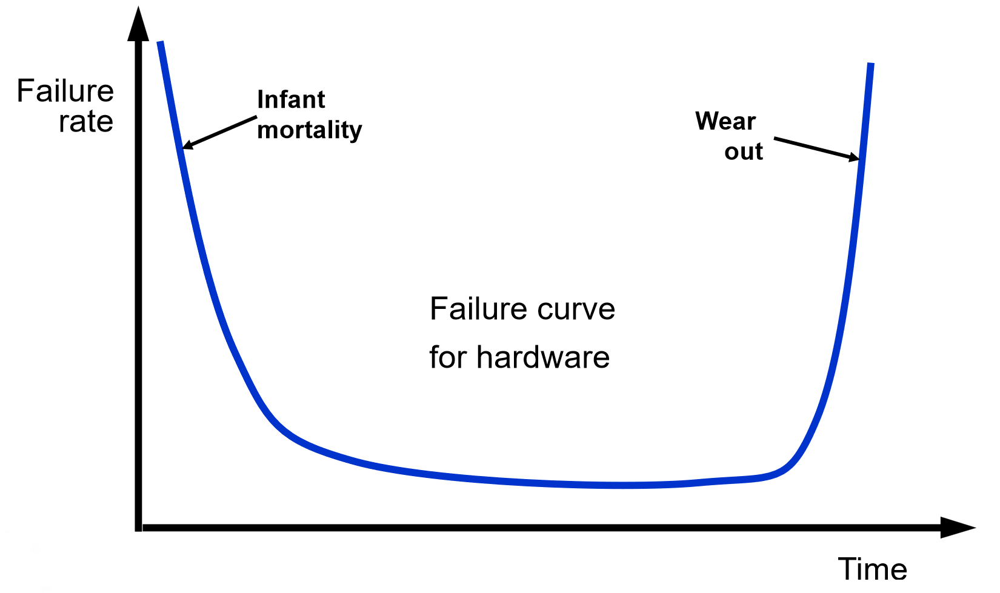
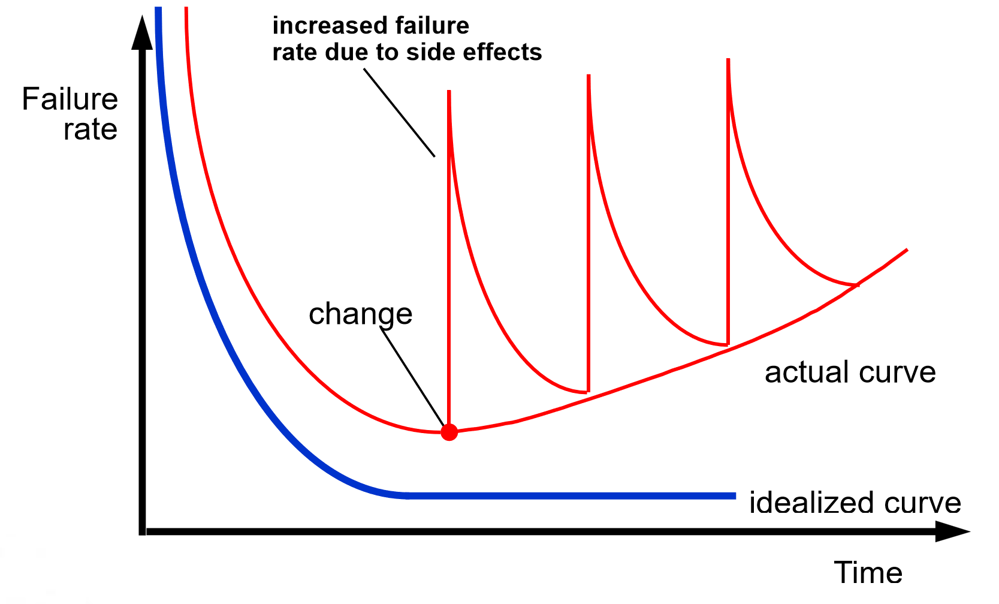

## 软件工程

> 2024

### Nature of software

**Software** - 构成 configuration 的一组对象，包括：

+ instructions (computer programs)：执行期望的功能
+ data structures：充分利用信息
+ documents：描述程序的操作和使用

软件不会如硬件一样完全损坏 (wear out)，但是会随着版本更新逐渐恶化 (deteriorate)。

|  |  |
| ------------------------------------------------------------ | ------------------------------------------------------------ |

!!!note
	Software deteriorates rather than wears out because
  	A) Software suffers from exposure to hostile environments
  	B) Defects are more likely to arise after software has been used often
  	C) Multiple change requests introduce errors in component interactions
  	D) Software spare parts become harder to order 
 	C

为何 **Legacy Software**(旧式软件) 必须更改：

+ software must be **adapted** to meet the needs of new computing environments or technology.
+ software must be **enhanced** to implement new business requirements.
+ software must be **extended** to make it interoperable with other more modern systems or databases.
+ software must be **re-architected** to make it viable within a network environment.

**Product Line Software** - 产品线软件

+ Product line software is a set of software-intensive systems that share a common set of features and satisfy the needs of a particular market
+ These software products are developed using the same application and data architectures using a common core of reusable software components

+ A software product line shares a set of assets that include requirements, architecture, design patterns, reusable components, test cases, and other work products
+ A software product line allow in the development of many products that are engineered by capitalizing on the commonality among all products with in the product line

!!!note
	The nature of software applications can be characterized by their information
	A) complexity
	B) content
	C) determinacy
	D) both b and c
	D

### Soft Engineering

**软件工程** - The application of a **systematic**, **disciplined**, **quantifiable** approach to the development, operation, and maintenance of software; that is, the application of engineering to software.

**保护伞活动** - 贯穿软件开发周期的一些活动，例如风险管控质量评估。

**Generic Process Framework**

+ **Communication** (customer collaboration and requirement gathering) 
+ **Planning** (establishes engineering work plan, describes technical risks, lists resource requirements, work products produced, and defines work schedule) 
+ **Modeling** (creation of models to help developers and customers understand the requires and software design) 
+ **Construction** (code generation and testing) 
+ **Deployment** (software delivered for customer evaluation and feedback)

!!!note
	Most software continues to be custom built because
	A) Component reuse is common in the software world.
	B) Reusable components are too expensive to use.
	C) Software is easier to build without using someone else\'s components.
	D) Off-the-shelf software components are available in many application domains.
    D

